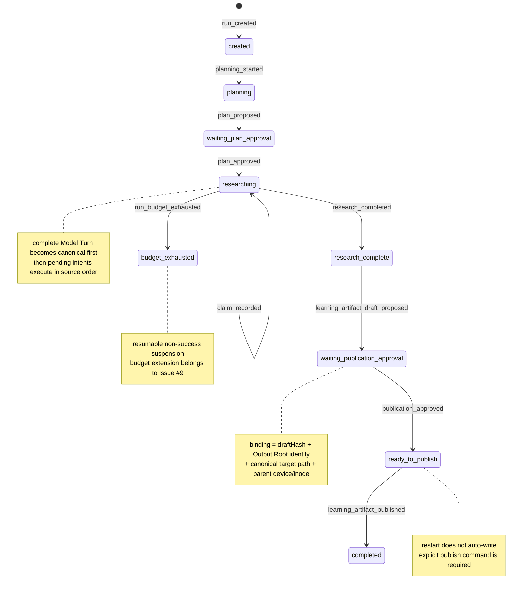

# Evidence Research Agent 架构（Issue #6）

当前 slice 已经把 #5 的 Evidence-backed publication 路径接到真正有界的多轮 Research Loop：一个 durable approved 的 Run 每轮从 canonical facts 重建 Model View，由 Scripted Model 返回完整、provider-neutral Model Turn，Harness 再按原始 intent 顺序调度五个模型可见 Research Tools。研究只有在 `complete_research` 成功后才成为 `research_complete`；任一硬预算耗尽则 durable 进入 `budget_exhausted`，不会被当作完成或进入 publication。

外层 workflow 仍由 Harness 确定性控制。模型不能审批计划、扩大 Source Scope、提高预算、调用 shell、绕过 Evidence Gate 或授权 publication。当前仍没有自动 retry、live model、并行 tool batch、预算扩展恢复或 publication crash reconciliation；这些分别属于后续 tickets。

## 组件、端口与单向能力流

```mermaid
flowchart LR
  Caller["TypeScript caller / CLI"] --> Runtime["ResearchAgentRuntime"]
  Runtime --> Harness["Deterministic Harness"]

  Harness <--> Journal["Run Journal"]
  Journal --> Projection["Run Projection"]
  Projection --> View["Model View Builder<br/>pinned facts + deterministic trimming"]
  View --> Model["Model Port<br/>Scripted Model"]
  Model --> Loop["Bounded Research Loop"]
  Loop -->|"model_turn_completed"| Journal
  Loop --> Scheduler["Research Tool Scheduler<br/>sequential in Issue #6"]

  subgraph ResearchTools["Exactly five model-visible Research Tools"]
    Search["search_sources"]
    Read["read_source"]
    RecordEvidence["record_evidence"]
    ProposeClaim["propose_claim"]
    CompleteResearch["complete_research"]
  end

  Scheduler --> Search
  Scheduler --> Read
  Scheduler --> RecordEvidence
  Scheduler --> ProposeClaim
  Scheduler --> CompleteResearch

  subgraph SourceBoundary["Private source boundary"]
    Policy["Shared Source policy<br/>canonical root + realpath preflight"]
    Searcher["Fixed-argument rg<br/>bounded discovery"]
    Reader["Bounded UTF-8 capture<br/>explicit read only"]
  end

  subgraph RuntimeHome["Private Runtime Home"]
    Snapshot["ContentAddressedArtifactStore<br/>private Source Snapshot"]
    SearchArtifact["Bounded search result Artifact<br/>full matches"]
    Registry["SqliteRunStore<br/>snapshot + artifact registry"]
    Evidence["Evidence Records"]
    Claim["Claims"]
    Draft["Private Markdown draft<br/>learning_artifact_draft_proposed"]
    Approval["User publication receipt<br/>publication_approved"]
  end

  Search --> Policy
  Policy --> Searcher
  Searcher -->|"bounded matches"| SearchArtifact
  SearchArtifact --> Registry
  Registry -->|"artifact reference + match count"| Journal
  Read --> Policy
  Policy -->|"approved explicit read"| Reader
  Reader --> Snapshot
  Snapshot --> Registry
  Registry -->|"source_read_observed + tool observation"| Journal
  Policy -->|"denied / stale / failed observation"| Journal
  RecordEvidence -->|"evidence_recorded + tool observation"| Journal
  ProposeClaim -->|"claim_recorded + tool observation"| Journal
  CompleteResearch --> Journal
  Journal --> Evidence
  Journal --> Claim

  Projection --> Budget["Five-dimensional Run Budget"]
  Budget -->|"hard limit"| Exhausted["budget_exhausted"]
  Projection --> ResearchComplete["research_complete"]
  Gate["Evidence Gate + deterministic renderer"]
  Publisher["LearningArtifactPublisher<br/>same-directory no-clobber publish"]
  Trace["Run Trace projection"]

  ResearchComplete --> Gate
  Gate --> Draft
  Draft --> Approval
  Approval --> Publisher
  Publisher --> Journal
  Journal --> Trace
```

`advanceResearch` 是当前主 seam。每轮开始时，Runtime 只从 Run Journal、derived Projection 和 plan artifact 构造新的 Model View；它不会把 Journal 或完整 `messages[]` 直接传给模型。fixed rules、批准计划、approval binding、预算版本与余额、pending intents、evidence gaps 和最新 steering 是 pinned facts。超过 Model View 字节上限时，Builder 先删除最旧 observations，再从尾部删除 Evidence；pinned facts 仍放不下便抛出 `ModelViewTooLargeError`，不请求 LLM 摘要隐藏约束。

Harness 只在完整 generation 返回并通过结构 schema 后追加 `model_turn_completed`。该事件同时把有序 tool intents 变为 durable pending work；重启后的 `advanceResearch` 会先消费这些 pending intents，而不是再次 generation。`ResearchLoopLifecycleHooks` 为测试暴露 Model Turn append 前/后、search Artifact 写入后和 search observation append 后四个命名中断点：若在 durable Model Turn 后中断，重启只执行 pending intent；若在 search CAS 写入但 Journal append 前中断，孤立 Artifact 不成为事实，重启重新执行仍 pending 的 search。Issue #6 的 scheduler 刻意顺序执行全部 intents；safe sibling search/read 的并发和原始顺序回填留给 Issue #11。

`search_sources` 与 `read_source` 共享 Source Scope 权限边界。搜索通过可注入 `SourceSearchPort` 调用默认的固定参数 `rg` adapter，下推 extension、exclusion、secret 与 file-size 过滤，启动前复核批准 root identity，每个命中再过 realpath preflight。完整命中列表写入私有 JSON Artifact；Journal observation 只保存 artifact 引用和 `matchCount`，下一轮 Model View 再按需校验并展开最近结果。搜索仍不创建 Source Snapshot。只有成功 explicit read 才冻结完整原始 UTF-8 字节；`invalid`、`denied`、`stale` 与 `failed` 都只落安全 observation。Evidence Record 也没有读取 live file 的能力，只能由 Runtime 从已持久化的成功 observation 逐字段派生。

## Evidence、Claim、Gate 与 draft 的职责分离

1. **Source Snapshot** 解决“当时看到了哪一版完整字节”。完整文件而非仅摘录被冻结，因而以后可以核对读取范围所在的同一版本。
2. **Evidence Record** 解决“哪一个已冻结来源事实可以被引用”。当前 `kind` 固定为 `source_fact`，一个成功 observation 最多登记一次 Evidence。
3. **Claim** 解决“要在学习工件中表达什么”。当前最小 slice 也显式保存 `kind: source_fact`、文本与已有 `evidenceIds`；重复、未知、空引用、未分类文本或预渲染 citation 都会被 reducer 拒绝。
4. **Evidence Gate** 在 `research_complete` 后检查模型选中的每个 Claim 都能通过结构化 `source_fact` Evidence 回溯，并从 Journal 重算实际 plan/research model turns、Research Tool calls、按 Source Snapshot identity 去重的 distinct sources、source bytes 与 Research Loop wall time。没有有效 Evidence、预算已耗尽或 Run 仍处于 `budget_exhausted` 时，Runtime 不创建 draft artifact，也不会触碰 publication target。
5. **确定性 renderer** 是唯一产生 `【Evidence: <id>】` 的位置，并固定输出 `Claims`、`Evidence Index` 和紧凑 `Tool usage` 三个部分。`ModelPort.proposeLearningArtifact` 只能提交标题、摘要和既有 Claim ID 的展示顺序；它不能创建 Claim、Evidence 或 citation ID，且 title/summary/Claim 文本中的预渲染 `【Evidence:` token 会被拒绝。因此每一个可见 citation 都来自被 Gate 选中的结构化 Evidence。

Search result 与 Markdown draft 都写入私有通用 artifact namespace，并分别和引用它们的 `research_tool_observed` / `learning_artifact_draft_proposed` 事件在同一个 SQLite 事务中注册。store 会拒绝“事件引用却没有匹配 artifact registry 行”的批次；Projection cache 与 Trace 仍从 canonical Journal 派生，且不复制 search 行正文。

## 运行状态机与用户 publication gate

`research_complete` 不是最终 terminal `completed`：它只表示模型通过 `complete_research` 显式结束调查并保存 unresolved questions，可以进入确定性 Gate。完成工具返回后 Runtime 会用同一 canonical budget calculator 再检查 Model Turn 与 wall time；若此时刚好耗尽，Run 会进入 `budget_exhausted`，并以 `researchOutcome: research_complete` 保留 completion provenance，而不是伪装为可发布成功。更早暂停则保存 `researchOutcome: incomplete`。两者都是 suspended non-success，均拒绝 draft/publication；Issue #9 才会加入新预算版本、重新审批和精确恢复。

publication 状态以 `researchOrigin` 判别 provenance：Issue #5 的零 Research Loop Model Turn 显式教学路径只能是 `legacy_explicit`，真正多轮路径只能是 `research_loop` 且结构上必须同时保留非空 Model Turns、tool observations、`researchStartedAt` 与 `completion`。因此 schema 和 reducer 都无法表达“有 Research Loop turns 但没有完成事实”或“零 turn 凭空带 completion”的非法组合。

`publication_approved` 也不是“文件已经写好”的断言。用户命令只批准等待状态中显示的 `draftHash`、canonical Output Root、`targetCanonicalPath`、父目录 `device` 和 `inode` 的精确聚合 hash。Runtime 在接受 receipt 前重新捕获 root 与 target parent identity；若目录被替换、target 逃出 root 或 canonical target 改变，旧 binding 失效。receipt 进入 `ready_to_publish` 后，只有显式 `publishLearningArtifact` 才会调用外部 publisher；正常 publisher 返回后才追加 `learning_artifact_published` 并进入 terminal `completed`。

Trace 依次暴露不含源正文的 lineage：`read_source` 的 observation/tool call/Snapshot，**每个 Evidence 的相同 observation/tool call/Snapshot**，再到 Claim ID、draft artifact ID、publication receipt ID 与最终 Markdown SHA-256。这样可以从最终工件反向追到每条结构化证据实际来自哪次 Tool 调用，而不会把绝对来源路径、摘录正文、私有 Runtime Home 或 OS 错误放入 Trace。

## 正常发布语义与未实现的 crash 边界

`LearningArtifactPublisher` 不创建父目录，也不跟随 final symlink。它在经批准的同一父目录内创建 `0600`、`O_EXCL|O_NOFOLLOW` temporary file，写完并 fsync 后再用 hard-link 原子创建最终名称，最后删除 temporary file。这里没有使用普通 `rename`：Node 的可移植 `rename` 会覆盖已存在文件，而 Node 没有暴露 `renameat2(RENAME_NOREPLACE)`；hard-link publication 既保证读者看不到半成品，也能在并发存在不同内容时 fail closed。若 final regular file 已经是完全相同的字节，发布幂等成功；若内容不同则绝不覆盖。

`Output Root` 必须在 Runtime 打开时显式配置，必须是与私有 Runtime Home 不重叠的 canonical directory；publisher 只接受其内 target，并把 root 的 device/inode 绑入 approval。parent identity 与 root identity 会在写入前后复核以检测稳定可观测的替换，但不宣称能够原子隔离 hostile same-user concurrent rename。

更重要的是，本 ticket 只承诺正常返回路径：若进程在外部 publication 尝试与 Journal `learning_artifact_published` 追加之间崩溃，重启不会自动把文件存在推断为完成。Issue #14 将定义 durable effect/operation 记录与 crash reconciliation；当前用户可显式再次调用 publish，publisher 只会接受 exact identical bytes。

## 当前边界与后续 ticket

- Issue #7 才加入错误分类、attempt、retry/backoff 与恢复策略。
- Issue #8 才用 Vercel AI SDK `streamText` 接入 OpenAI-compatible live Model Port；SDK 类型仍隔离在 `ModelPort` 后。
- Issue #9 才加入用户暂停、取消、预算版本扩展以及从 `budget_exhausted` 的恢复。
- Issue #11 才加入 safe search/read sibling batch 的有界并发与模型原始顺序回填。
- Issue #14 才把 publication 外部 effect 的 crash reconciliation 做成 durable protocol。
