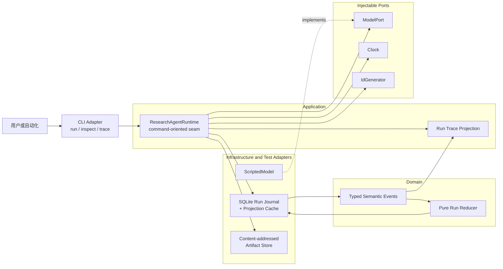
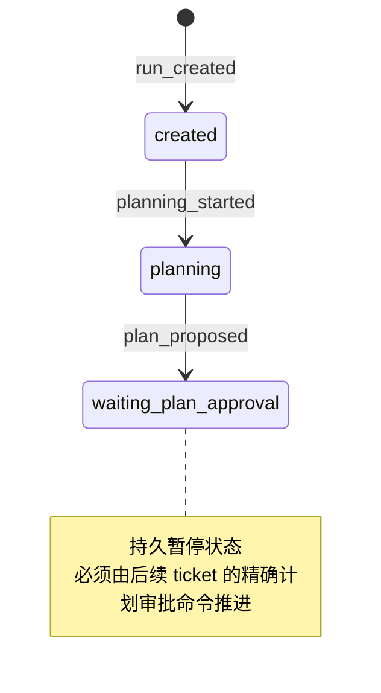

# Evidence Research Agent 架构（Issue #2）

本文只描述第一个可运行 planning slice：创建 Research Run、生成计划、追加语义事件，并持久停在 `waiting_plan_approval`。计划批准、Research Loop、Research Tool 和发布不在本 ticket 中。

## 组件与端口

关键边界：Model Port 只返回 provider-neutral 的完整计划；AI SDK 类型不得进入 runtime。SQLite 中的 Run Journal 是 canonical history，缓存 Projection 与 Trace 都只通过同一个纯 reducer 派生。

## 当前 Run 状态机

`waiting_plan_approval` 不是终态。CLI 进程退出不会丢失它；新进程从同一 Runtime Home 读取缓存投影，缓存缺失时从追加式 Journal 重建。

## 追加与投影不变量

1. `run_events` 只能 `INSERT`；SQLite trigger 拒绝 `UPDATE` 与 `DELETE`。
2. 每个 Run 的 `sequence` 从 1 开始且严格连续，写入使用 expected-last-sequence 防止静默覆盖并发进展。
3. 新事件与缓存 Projection 在同一短事务中提交；Model 调用与 Artifact 文件写入不持有 SQLite 写锁。
4. Projection cache 可丢弃。`rebuildRunProjection` 只回放 Journal，不调用模型，也不重新生成计划。
5. 计划正文进入内容寻址 Artifact Store；Journal 只持久化稳定引用和重建状态所需事实。
