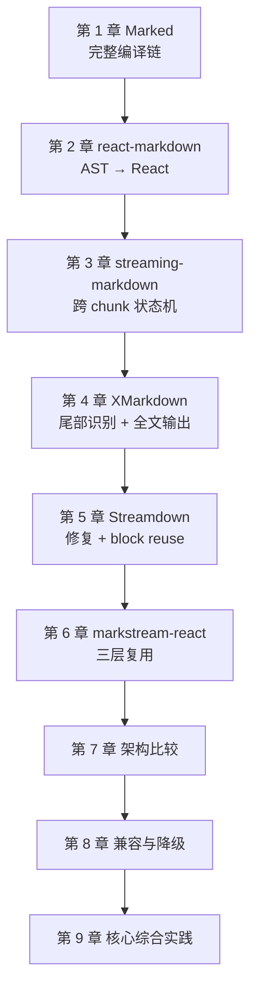

# 流式 Markdown 渲染器源码课程：学习路线

## 学完后应该能做什么

- 区分网络流、逐字动画、累计字符串渲染和真正增量 parser；
- 解释 lexer、token、mdast、hast、React node 与 DOM 各自的复用边界；
- 为未闭 code fence、link、table 和 HTML 设计 streaming/final 双阶段语义；
- 判断一次缓存优化是否真的减少解析工作，还是只复用了实例或调度优先级；
- 设计 sanitize、URL policy、外链确认和重组件延迟执行的安全边界；
- 用随机 chunk、逐字符 chunk、非前缀改写和 final reset 验证正确性；
- 为低版本浏览器提供不会白屏的 final-only 或纯文本降级。

## 先修知识

开始前只需要：

- 能阅读 TypeScript/JavaScript；
- 理解 React render 与 key 的基本作用；
- 知道 Markdown 最终会变成 HTML 或 UI 节点。

CommonMark、unified、增量 parser、Resize/调度和浏览器兼容细节会在相应章节中引入。

## 课程地图

## 第一部分：建立完整编译的成本模型

### 第 1 章：[Marked——底层 Markdown 编译器](01-marked.md)

核心问题：一次 `parse(text)` 到底完成哪些工作，为什么它本身不等于流式 renderer？

完成标准：能画出 `preprocess → lexer → token walk → parser → postprocess`，并说明 sanitizer、stream 生命周期和 UI 更新为什么在它的边界之外。

### 第 2 章：[react-markdown——非流式 React 基线](02-react-markdown.md)

核心问题：Markdown AST 怎样经过 mdast、hast 和组件映射进入 React？

完成标准：能说明 processor 实例缓存与 AST 复用的区别，并指出 `children` 改变时哪些阶段会重新执行。

## 第二部分：理解真正的流式 parser

### 第 3 章：[streaming-markdown——跨 chunk 状态机](03-streaming-markdown.md)

核心问题：只消费新增字符时，parser 必须保存哪些开放 token、父节点和属性状态？

完成标准：把同一 Markdown 随机切成不同 chunk，最终 DOM 语义一致；能够解释 optimistic parsing 与属性后设。

## 第三部分：比较三种 React 工程折中

### 第 4 章：[Ant Design X Markdown——尾部识别与全文输出](04-ant-design-x-markdown.md)

核心问题：为什么增量识别 suffix 可以改善未闭语法 UX，却不一定降低全文编译成本？

完成标准：能区分 recognizer cache、完整 output 和下游 Marked/sanitize/HTML→React 三类工作。

### 第 5 章：[Streamdown——全文修复与块级复用](05-streamdown.md)

核心问题：怎样在每次全文 lex 的前提下，让稳定 block 跳过 unified transform 与 React render？

完成标准：能解释 `remend`、block identity、static mode 和 processor cache 分别解决什么。

### 第 6 章：[markstream-react——三层复用](06-markstream-react.md)

核心问题：token prefix、structured node 和 React node 三层缓存分别依赖什么 identity？

完成标准：能指出哪些配置会关闭快速路径，并为长文、批量提交和虚拟化设计一致性测试。

## 第四部分：组合成自己的 Renderer

### 第 7 章：[五种架构比较](07-comparison.md)

把六个项目还原为五种渲染模型，比较成本发生位置、未闭语法、安全边界与 final 语义。

### 第 8 章：[低版本浏览器与 iOS](08-legacy-browser-compatibility.md)

学习 capability detection、final-only、纯文本 fallback 和 SSR/hydration 失败时的非空白兜底。

### 第 9 章：[核心综合实践](09-capstone-streaming-renderer.md)

实现一个最小 renderer。MVP 证明：

1. 任意合法 chunk 切分不改变 final 结果；
2. streaming 临时语义在 final 阶段被清除；
3. 非前缀改写会显式 reset，而不是污染增量状态；
4. 危险 URL 与 raw HTML 有明确 policy。

正确性扩展再证明稳定 block 不反复执行重插件；生产化扩展再验证旧浏览器和增强能力失败时不白屏。

## 每章四遍法

1. **看成本边界**：本次输入是累计全文还是新增 chunk？
2. **追状态**：哪些对象跨更新保存，哪些每次重建？
3. **做失败推演**：未闭语法、final、reset、重组件或旧浏览器会怎样？
4. **完成练习**：用 trace、DOM/React identity 和自动测试验收。

## 按目标选择支线

| 目标 | 建议路径 |
|---|---|
| 理解 Markdown 编译与 React | 1 → 2 |
| 研究真正增量 parser | 1 → 3 |
| 为现有 React Chat 选库 | 1 → 2 → 3 → 4 → 5 → 6 → 7 |
| 只实现 final-only/纯文本兜底 | 1 → 2 → 8 的“基础降级路线” |
| 比较六种方案的完整兼容边界 | 1 → 2 → 3 → 4 → 5 → 6 → 7 → 8 |
| 自研流式 renderer | 完成 1–9 |

## 研究附录

- [固定提交源码证据、测试与 benchmark 审计](../streaming-markdown-renderers-research.md)
- [练习答案要点与常见错误](SOLUTIONS.md)
- [固定 corpus、FSM 骨架与测量表](EXERCISE-FIXTURES.md)
- [章节维护模板](_chapter-template.md)
