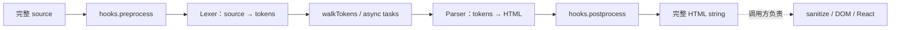

# 第 1 章 Marked：先建立完整 Markdown 编译基线

> 仓库：[`markedjs/marked`](https://github.com/markedjs/marked)  
> 固定 commit：[`58ed4af62e7383ca770ac68aa987ca39887f33f3`](https://github.com/markedjs/marked/commit/58ed4af62e7383ca770ac68aa987ca39887f33f3)  
> 本轮版本：`18.0.7`  
## 本章要解决的问题

在讨论“增量”之前，先看清一次完整 Markdown 编译做了什么。Marked 提供最局部的 lexer→token→HTML 路径，适合建立后续比较都会复用的成本模型。

## 本章目标

| 项目 | 内容 |
|---|---|
| 前置知识 | JavaScript 字符串与函数调用 |
| 本章重点 | Lexer、Parser、extension 与 sanitize 边界 |
| 第一遍重点 | `parse`、Lexer、Parser、Hooks |
| 完成后应能回答 | 为什么 async parse 不是 stream parser？为什么 Markdown→HTML 之后仍不能直接插入 DOM？ |

## 核心心智模型

Marked 是高性能、扩展能力强的 Markdown→HTML 编译器，但 `parse` 的基本契约是“给我一份完整 source，我返回完整 HTML”。它不管理 React、chunk 生命周期、未闭语法 UX 或 sanitize。XMarkdown 用它生成完整 HTML；Streamdown 只借它的 lexer 做顶层分块。



## 核心源码原文：Lexer 与 Parser 的完整边界

Marked 同步分支的关键语句按执行顺序原样摘录；省略的是 hooks 的可选包裹分支：[源码 L323-L340](https://github.com/markedjs/marked/blob/58ed4af62e7383ca770ac68aa987ca39887f33f3/src/Instance.ts#L323-L340)。

```ts
let tokens = lexer(src, opt);
if (opt.walkTokens) {
  this.walkTokens(tokens, opt.walkTokens);
}
let html = parser(tokens, opt);
return html;
```

- `lexer(src, opt)`：输入是本次完整 source，输出完整 token 数组。
- `walkTokens(tokens, ...)`：扩展遍历当前全部 token tree。
- `parser(tokens, opt)`：全部 tokens 被编译为本次完整输出。
- 返回值没有稳定 block/node identity；流式生命周期必须由上层管理。

静态 lexer 每次都会新建实例：[源码 L72-L91](https://github.com/markedjs/marked/blob/58ed4af62e7383ca770ac68aa987ca39887f33f3/src/Lexer.ts#L72-L91)。

```ts
static lex(src: string, options?: MarkedOptions) {
  const lexer = new _Lexer(options);
  return lexer.lex(src);
}
```

- `new _Lexer(options)`：没有从前一次调用取得 token prefix。
- `lexer.lex(src)`：当前 source 从头进入这个新实例。
- 这正是 Streamdown 每次调用 `Lexer.lex` 时仍需全文词法扫描的依据。

## 1. `parse` 的完整编译链

源码锚点：[`src/Instance.ts L275-L347`](https://github.com/markedjs/marked/blob/58ed4af62e7383ca770ac68aa987ca39887f33f3/src/Instance.ts#L275-L347)

```ts
// 学习版等价伪代码
function parse(source, options) {
  // 1. 扩展可以在词法分析前修改完整 source。
  const prepared = hooks.preprocess(source)

  // 2. Lexer 从头扫描完整 prepared source。
  const tokens = lexer(prepared, options)

  // 3. walkTokens 给扩展遍历/修改 token 的机会。
  walkTokens(tokens)

  // 4. Parser 把完整 token list 编译成 HTML。
  const html = parser(tokens, options)

  // 5. 最后再允许整体后处理。
  return hooks.postprocess(html)
}
```

这条 API 没有旧 token 参数，也没有新增 chunk 参数。若每次传入不断增长的累计全文，就会反复执行整条编译链。

## 2. 为什么 XMarkdown 的 suffix cache 不能降低 Marked 全文成本

源码关联：[XMarkdown 完整 parse](https://github.com/ant-design/x/blob/b529d8e96d5b35fe81ec68922fedb1ea124c7235/packages/x-markdown/src/XMarkdown/index.tsx#L100-L110)、[Marked 同步编译链](https://github.com/markedjs/marked/blob/58ed4af62e7383ca770ac68aa987ca39887f33f3/src/Instance.ts#L323-L340)。

```ts
// XMarkdown 先隐藏/替换不稳定尾部：
const visibleMarkdown = useStreaming(cumulativeText)

// 但这里只能把“当前可见全文”交给 Marked：
const html = marked.parse(visibleMarkdown)
```

suffix cache 减少的是未闭语法识别成本；只要 `visibleMarkdown` 变化，Marked 仍从头 lexer/parser。若希望真正增量解析，需要 parser 自身保存跨 chunk state 或复用 token prefix。

## 3. Streamdown 为什么只用 Lexer

源码关联：[Streamdown 分块入口](https://github.com/vercel/streamdown/blob/e5deed330aa4231751a106445d93d62e4716a22f/packages/streamdown/lib/parse-blocks.tsx#L96-L112)、[Marked `Lexer.lex`](https://github.com/markedjs/marked/blob/58ed4af62e7383ca770ac68aa987ca39887f33f3/src/Lexer.ts#L72-L91)。

```ts
// 学习版示意
const topLevelTokens = MarkedLexer.lex(repairedMarkdown, { gfm: true })

// Marked 在这里负责“找顶层块边界”，并不负责最终 React 输出。
const blocks = mergeSpecialCases(topLevelTokens)

// 每个变化 block 随后交给 unified：remark → rehype → JSX。
```

这是一个值得学习的组合：使用 Marked lexer 的速度和 token 边界，但保留 unified 插件链与 HAST→React 的扩展方式。

## 4. Extension 系统的设计价值

Marked 允许扩展 tokenizer、renderer、hooks 和 token walk。学习时应区分：

- tokenizer extension：改变 source 如何形成 token。
- renderer extension：改变 token 如何生成 HTML。
- hooks：整体 preprocess/postprocess 或流程协调。
- walkTokens：递归访问 token，用于收集信息或异步准备。

扩展越多，每次流式全文重跑的工作越多；扩展对象应稳定复用，不要在 React render 中重复注册。

## 5. Async mode 仍不是 stream parser

源码锚点：[Marked async 分支 L308-L320](https://github.com/markedjs/marked/blob/58ed4af62e7383ca770ac68aa987ca39887f33f3/src/Instance.ts#L308-L320)。

```ts
// 学习版等价伪代码
if (options.async) {
  const tokens = lexer(fullSource)
  await Promise.all(walkTokenTasks(tokens))
  return parser(tokens)
}
```

异步模式允许 `walkTokens` 等步骤等待 Promise，但输入仍是完整 source。Async 与 incremental 是两个正交概念。

## 6. 安全边界：Marked 明确不 sanitize

官方 README 明确指出 Marked 不负责清洗输出，并建议在使用 HTML 前接入 DOMPurify 等 sanitizer。[官方安全警告](https://github.com/markedjs/marked/blob/58ed4af62e7383ca770ac68aa987ca39887f33f3/README.md#L53-L56)

```ts
// 浏览器侧示意
const unsafeHtml = marked.parse(untrustedMarkdown)
const safeHtml = DOMPurify.sanitize(unsafeHtml)
```

若再通过 `dangerouslySetInnerHTML` 或 HTML parser 生成 UI，sanitize 必须发生在这之前。URL、图片代理、外链确认、CSP 仍是额外策略，不应和 HTML sanitize 混为一谈。

## 7. SSR、测试与 benchmark 证据边界

### SSR / 运行时

Marked 核心是字符串→tokens→字符串的编译器，不依赖 React 或 DOM，可以直接在 Node/SSR/构建脚本中运行。若在服务端 sanitize，应选支持当前 Node 环境的 sanitizer；若把未清洗 HTML 传到客户端再插入 DOM，安全责任仍未完成。

### 测试证据

- 仓库包含 Lexer、Parser、Hooks、instance、CLI 与 CommonMark/GFM fixtures。[Parser tests](https://github.com/markedjs/marked/blob/58ed4af62e7383ca770ac68aa987ca39887f33f3/test/unit/Parser.test.js#L1-L20)
- Async 类型与运行时测试验证 Promise/string 行为，但它们不代表跨 chunk parser state。[async tests](https://github.com/markedjs/marked/blob/58ed4af62e7383ca770ac68aa987ca39887f33f3/test/unit/marked.test.js#L668-L701)
- Marked 不提供 React reconciliation、incomplete Markdown UX 或 sanitizer 测试，因为这些不属于其职责。

本轮未执行完整测试套件。

### Benchmark 证据

仓库自带 [parser benchmark harness](https://github.com/markedjs/marked/blob/58ed4af62e7383ca770ac68aa987ca39887f33f3/test/bench.js#L1-L80)，比较的是 compiler 负载，不覆盖 DOMPurify、HTML→React、高亮或流式 UI 生命周期。因此不能直接与 Streamdown/XMarkdown 的端到端体验排名等同。

## 8. 低版本浏览器与 iOS

Marked 只接收字符串并同步返回 HTML，不读取 `ReadableStream`，也不知道响应是否完成。调用方每收到一批累计文本就调用 `parse()`，界面就可持续更新；只在 final 调用，则完成后一次展示。两种行为都由应用决定。

固定源码与构建产物使用 `.at()`、可选链和空值合并，build 没有声明 legacy browser target。若浏览器无法解析 bundle 或缺少对应内建对象，通常是模块加载/运行失败，而不是自动缓存到 final。`silent: true` 只处理 parser 抛出的错误并返回转义错误文本，不能修复浏览器语法兼容，也不是安全清洗。

需要覆盖旧设备时，应明确转译应用和依赖、补齐运行时 polyfill；网络不支持增量读取时先缓存完整 Markdown，再执行一次 `parse()` 和 sanitize。若在服务端完成 Marked + sanitize，还能直接交付静态 HTML，避免客户端 renderer 白屏。

## 9. 什么时候直接选择 Marked

- 需要 Markdown→HTML 字符串，而不是 React tree。
- 愿意自己负责 sanitize、组件挂载与流式调度。
- 编译链简单，追求小而直接的 parser/renderer API。
- 作为更高层 renderer 的 lexer/compiler 基础。

Marked 解决的是更低一层的编译问题，不是 Streamdown/XMarkdown 这类 UI renderer 的直接替代。

## 本章练习

用 Marked 实现一个最小 `compile(markdown) → safeHtml` 管线：记录 preprocess、lexer、walkTokens、parser、sanitize 的调用次数；随后把累计字符串按 20 次更新重复编译。

### 练习验收

- 能从 trace 证明每次 `parse` 都重新经过完整编译链；
- 危险 HTML/URL 由独立 sanitizer/policy 处理；
- 能估算累计全文高频更新为何可能放大总工作量。

## 检查理解

1. Lexer 与 Parser 分别消费和产生什么？
2. extension cache 与跨 chunk parser state 有什么区别？
3. 为什么 `async: true` 仍然不提供 streaming 生命周期？

## 本章小结

Marked 建立了最重要的基线：完整输入对应完整编译。下一章把 token/AST 继续送入 React，观察 UI 层又增加了哪些工作。

---

[课程目录](00-learning-guide.md) · [下一章：react-markdown](02-react-markdown.md)
