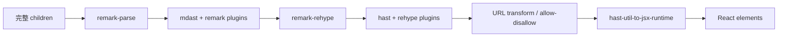

# 第 2 章 react-markdown：从 Markdown AST 到 React

> 仓库：[`remarkjs/react-markdown`](https://github.com/remarkjs/react-markdown)  
> 固定 commit：[`fda7fa560bec901a6103e195f9b1979dab543b17`](https://github.com/remarkjs/react-markdown/commit/fda7fa560bec901a6103e195f9b1979dab543b17)  
> 本轮版本：`10.1.0`  
## 本章要解决的问题

Marked 只返回 HTML 字符串；React 应用还需要 AST transform、组件映射和 reconciliation。本章用 react-markdown 建立非流式 React renderer 的标准基线。

## 本章目标

| 项目 | 内容 |
|---|---|
| 前置知识 | 第 1 章；React render 与 key 的基本概念 |
| 本章重点 | mdast→hast→React、plugin、component mapping 与 URL policy |
| 第一遍重点 | processor 构造、`runSync`、`toJsxRuntime` |
| 完成后应能回答 | processor 实例缓存为什么不等于 AST 复用？children 增长时哪些阶段会重跑？ |

## 核心心智模型

react-markdown 是成熟、安全默认值清晰、扩展生态强的 React Markdown renderer，但它没有 streaming 生命周期、未闭语法状态或稳定 block cache。把不断增长的全文反复传给它可以形成“流式视觉”，却仍是每次全文 unified 处理。



## 核心源码原文：一次同步 render 的完整工作

固定 commit 的同步组件只有五行，却完整暴露了成本边界：[源码 L175-L179](https://github.com/remarkjs/react-markdown/blob/fda7fa560bec901a6103e195f9b1979dab543b17/lib/index.js#L175-L179)。

```js
export function Markdown(options) {
  const processor = createProcessor(options)
  const file = createFile(options)
  return post(processor.runSync(processor.parse(file), file), options)
}
```

- `createProcessor(options)`：同步组件每次调用都会构建配置好的 unified processor。
- `createFile(options)`：把本次完整 `children` 包装为 VFile。
- `processor.parse(file)`：完整 Markdown→mdast。
- `runSync(...)`：完整执行 remark/rehype transforms。
- `post(...)`：HAST 再转为 React；没有旧 AST 或完成 block 参数。

Hooks 版本只缓存 processor 配置，其 effect 仍依赖 `children`：[源码 L214-L251](https://github.com/remarkjs/react-markdown/blob/fda7fa560bec901a6103e195f9b1979dab543b17/lib/index.js#L214-L251)。

```js
const processor = useMemo(
  function () { return createProcessor(options) },
  [options.rehypePlugins, options.remarkPlugins, options.remarkRehypeOptions]
)
```

- 依赖数组没有 `children`，所以文本增长不会重建 processor 配置。
- 后续 effect 仍会因 `children` 变化重新 `parse/run`；这是实例复用，不是 AST 复用。

## 1. 同步渲染为什么每次全文重做

源码锚点：[`lib/index.js L163-L179`](https://github.com/remarkjs/react-markdown/blob/fda7fa560bec901a6103e195f9b1979dab543b17/lib/index.js#L163-L179)

```js
// 学习版等价伪代码
function Markdown(options) {
  // 每次组件函数执行都会创建 processor。
  const processor = createProcessor(options)
  const file = createFile(options)

  // parse 读取完整 children，runSync 再执行所有 transforms。
  const tree = processor.runSync(processor.parse(file), file)

  // 完整 HAST 转为 React。
  return post(tree, options)
}
```

它没有缓存 AST。React 可能复用最终 DOM，但 remark/rehype 处理已经发生。

## 2. Unified pipeline 如何组装

源码锚点：[`createProcessor L254-L276`](https://github.com/remarkjs/react-markdown/blob/fda7fa560bec901a6103e195f9b1979dab543b17/lib/index.js#L254-L276)

```js
// 学习版等价伪代码
function createProcessor(options) {
  return unified()
    .use(remarkParse)                  // Markdown string → mdast
    .use(options.remarkPlugins)        // 在 Markdown 语义树上扩展
    .use(remarkRehype, options)        // mdast → hast
    .use(options.rehypePlugins)        // 在 HTML 语义树上扩展
}
```

这是 react-markdown 最大优势：remark/rehype 生态成熟，扩展点的语义层次明确。代价是插件链越重，流式全文重跑的成本越明显。

## 3. Async Hook 也不是增量 parser

源码锚点：[`MarkdownHooks L214-L251`](https://github.com/remarkjs/react-markdown/blob/fda7fa560bec901a6103e195f9b1979dab543b17/lib/index.js#L214-L251)

```js
// 学习版等价伪代码
const processor = useMemo(
  () => createProcessor(options),
  [remarkPlugins, rehypePlugins, remarkRehypeOptions]
)

useEffect(() => {
  let cancelled = false

  // children 一变，仍重新 parse/run 整篇。
  processor.run(processor.parse(file)).then(tree => {
    if (!cancelled) setTree(tree)
  })

  // 避免旧异步结果覆盖新内容；这解决竞态，不解决重复解析。
  return () => { cancelled = true }
}, [processor, options.children])
```

与同步版本相比，它缓存了 processor 配置并处理异步插件竞态，但没有复用旧 token/AST。

> cancelled 可以拦截的原理是闭包。每一次 useEffect 执行都会创建自己独立的 let cancelled = false
> 当依赖变化时，旧 effect 的 cleanup 把“旧闭包里的 cancelled”设为 true。即使旧异步回调之后才执行，它读取的仍是同一个旧闭包变量，于是被拦截。
新的 effect 则创建新的闭包、新的 cancelled = false，不会受旧任务影响。

## 4. HAST 如何变成 React

源码锚点：[`post L303-L409`](https://github.com/remarkjs/react-markdown/blob/fda7fa560bec901a6103e195f9b1979dab543b17/lib/index.js#L303-L409)

```js
// 学习版等价伪代码
function post(tree, options) {
  visit(tree, element => {
    // URL 先做协议转换/过滤。
    transformUrls(element, options.urlTransform)

    // allowElement / allowedElements / disallowedElements 控制节点去留。
    filterElement(element, options)
  })

  return toJsxRuntime(tree, {
    components: options.components,
    passNode: true,
  })
}
```

`components` 是 tag→React component 映射，不改变 parser 本身。自定义组件引用应保持稳定，避免无意义的 React subtree 更新。

## 5. Raw HTML 默认为什么相对安全

源码锚点：[`raw HTML handling L358-L385`](https://github.com/remarkjs/react-markdown/blob/fda7fa560bec901a6103e195f9b1979dab543b17/lib/index.js#L358-L385)、[`security guidance`](https://github.com/remarkjs/react-markdown/blob/fda7fa560bec901a6103e195f9b1979dab543b17/readme.md#L791-L801)

默认情况下，Markdown 中的 HTML 不会作为可执行 DOM 解析；可以作为文本显示，或通过 `skipHtml` 丢弃。只有显式添加 `rehype-raw` 才进入 raw HTML 解析，此时应配合 `rehype-sanitize`。

```js
// 推荐责任边界示意
<Markdown
  rehypePlugins={[
    rehypeRaw,       // 允许 HTML 进入 HAST
    rehypeSanitize,  // 随后按 schema 清洗
  ]}
/>
```

## 6. URL 默认策略

源码锚点：[`defaultUrlTransform L412-L447`](https://github.com/remarkjs/react-markdown/blob/fda7fa560bec901a6103e195f9b1979dab543b17/lib/index.js#L412-L447)

```js
// 学习版等价伪代码
function defaultUrlTransform(url) {
  const protocol = parseProtocol(url)

  // 相对地址和常用安全协议保留。
  if (!protocol || allowedProtocols.has(protocol)) return url

  // javascript:、vbscript:、file: 等返回空串。
  return ''
}
```

自定义 `urlTransform` 是 trusted hook；一旦覆盖默认逻辑，调用方要承担协议过滤责任。

## 7. 代码高亮如何接入

源码锚点：[`official example`](https://github.com/remarkjs/react-markdown/blob/fda7fa560bec901a6103e195f9b1979dab543b17/readme.md#L471-L519)

```tsx
// 学习版示意
const components = {
  code({ className, children, ...props }) {
    const language = /language-(\w+)/.exec(className ?? '')?.[1]

    return language
      ? <SyntaxHighlighter language={language}>{String(children)}</SyntaxHighlighter>
      : <code {...props}>{children}</code>
  },
}
```

高亮完全由调用方选择；库本身不会缓存 Shiki/Prism，也不知道 code block 是否仍处于流式未完成状态。

## 8. 用于流式 UI 时的上层策略

如果必须用 react-markdown 显示 LLM 流：

1. 不要每个 token 都 setState；按动画帧或 30–80ms 批量提交。
2. 把已经完成的消息/段落冻结为独立 memo component。
3. 高亮、Mermaid、KaTeX 可等 code fence 或消息完成后再启用。
4. 流结束后再做一次完整、安全的 final render。
5. 用真实 plugins 测量 parse/transform 时间，而不是只测空管线。

## 9. SSR、测试与 benchmark 证据边界

### SSR / 运行时

主入口没有 `"use client"`，同步 `Markdown` 和异步 `MarkdownAsync` 都以 VFile/unified/HAST→JSX 工作，不依赖 DOMPurify 或 `document`，因此适合 Node SSR 和构建期渲染。调用方加入的 rehype 插件或 React component 仍可能引入浏览器依赖；“核心可 SSR”不能推广为任意插件组合都可 SSR。

### 测试证据

- URL 测试直接覆盖 `javascript:`、`vbscript:`、`file:` 等协议被清空。[测试 L310-L335](https://github.com/remarkjs/react-markdown/blob/fda7fa560bec901a6103e195f9b1979dab543b17/test.jsx#L310-L335)
- Component 测试覆盖 `components.code` 的 HAST node/props 映射。[测试 L587-L608](https://github.com/remarkjs/react-markdown/blob/fda7fa560bec901a6103e195f9b1979dab543b17/test.jsx#L587-L608)
- 仓库测试验证标准 renderer API；它没有 streaming lifecycle，因此也没有 `hasNextChunk`、incomplete placeholder 或稳定 block identity 这一类测试。

本轮未执行完整测试套件。

### Benchmark 证据

本轮固定源码中没有可用于本文六包公平排名的流式 benchmark 结果。即使单次静态 parse 很快，也不能由此推导高频累计全文更新的表现；需要用同一插件、chunk 调度和 React 环境重测。

## 10. 低版本浏览器与 iOS

react-markdown 没有网络流或 final 生命周期：宿主每次传入累计 `children`，它就同步解析当前快照；宿主只在响应完成后更新，它就只渲染一次。因此“旧浏览器等待 final”只能是调用方的传输策略，不是库的自动行为。

官方支持口径是现代浏览器，基本排除 IE11，并建议通过 bundler、编译选项或插件支持 legacy browser。[官方兼容说明](https://github.com/remarkjs/react-markdown/blob/fda7fa560bec901a6103e195f9b1979dab543b17/readme.md#L608-L621) 固定源码直接使用 [`Object.hasOwn`](https://github.com/remarkjs/react-markdown/blob/fda7fa560bec901a6103e195f9b1979dab543b17/lib/index.js#L313-L378)；缺少 polyfill 时可能在每次 render 进入 `post()` 后抛错。

它的优势是核心可 SSR：若客户端 hydration 失败，服务端 HTML 仍可能保留，但交互和后续流式更新停止。推荐用 SSR/静态 HTML 或纯文本作为旧环境兜底，并在支持环境中对累计文本做 30–80ms 或按帧批量提交。

## 11. 最适合的场景

- 静态或低频更新 Markdown。
- 强依赖 remark/rehype 插件生态。
- SSR、构建期渲染、内容页与文档系统。
- 希望 raw HTML 默认不执行，并由调用方显式 opt-in。

它是优秀的“标准 React Markdown renderer”，不是开箱即用的“AI 流式稳定器”。

## 本章练习

用 react-markdown 渲染一段持续增长的消息，为 remark、rehype 和自定义 `components.code` 分别加计数器；再把提交频率从逐 token 改为按帧合并。

### 练习验收

- 能指出 processor 配置复用与 mdast/hast 重建的区别；
- 合并提交后输出语义不变，但 parse/transform 次数明显下降；
- raw HTML、URL transform 与自定义组件的责任边界有独立测试。

## 检查理解

1. mdast 和 hast 为什么是两种树？
2. React reconciliation 能否自动消除前面的全文 parse 成本？
3. 加入 `rehype-raw` 后为什么必须重新审视 sanitize？

## 本章小结

react-markdown 展示了完整 AST→React 管线，也说明“React 能持续更新”并不代表 parser 增量。下一章开始只消费新增 chunk。

---

[上一章：Marked](01-marked.md) · [课程目录](00-learning-guide.md) · [下一章：streaming-markdown](03-streaming-markdown.md)
