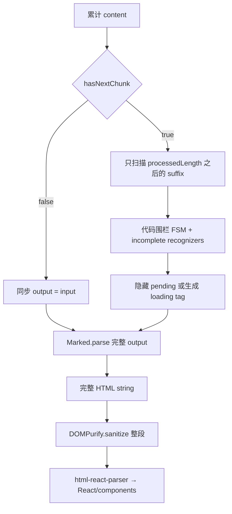

# 第 4 章 Ant Design X Markdown：尾部识别与全文输出重建

> 仓库：[`ant-design/x`](https://github.com/ant-design/x)，源码目录 `packages/x-markdown`  
> 固定 commit：[`b529d8e96d5b35fe81ec68922fedb1ea124c7235`](https://github.com/ant-design/x/commit/b529d8e96d5b35fe81ec68922fedb1ea124c7235)  
> 调研 HEAD 包版本：`@ant-design/x-markdown 2.9.0`；该 HEAD 晚于 npm `2.9.0` 的 `gitHead`，逐行实现不应自动等同于已发布 tarball  
## 本章要解决的问题

真正增量 parser 实现成本很高。XMarkdown 选择只增量识别不完整尾部，再用成熟全量管线生成 UI。本章研究这一折中改善了什么，又没有减少什么。

## 本章目标

| 项目 | 内容 |
|---|---|
| 前置知识 | 第 1–3 章 |
| 本章重点 | suffix cache、incomplete recognizer、code-fence FSM、全量输出重建 |
| 第一遍重点 | `useStreaming`、processed length、Renderer pipeline |
| 完成后应能回答 | suffix cache 缓存了什么？为什么它不等于 Marked/DOMPurify/HTML→React 增量？ |

## 核心心智模型

XMarkdown 的 `useStreaming` 会增量扫描新增 suffix，识别并隐藏/替换不完整尾部；但每次可见 `output` 变化，后续仍对整段执行 Marked、未闭组件扫描、DOMPurify 和 HTML→React。它是“流式语法稳定器 + 全量 renderer”，不是增量 Markdown AST。



## 核心源码原文：增量识别、全量输出

主组件中三个不同位置的关键调用按出现顺序原样摘录；空行表示省略中间的 memo 配置：[源码 L46-L47、L100-L110](https://github.com/ant-design/x/blob/b529d8e96d5b35fe81ec68922fedb1ea124c7235/packages/x-markdown/src/XMarkdown/index.tsx#L46-L110)。

```tsx
const output = useStreaming(content || children || '', { streaming, components });

return parser.parse(output, { injectTail: !!shouldShowTail });

() => (htmlString ? renderer.render(htmlString) : null)
```

- `useStreaming(...)`：先决定当前允许显示的完整 Markdown 字符串。
- `parser.parse(output, ...)`：任何可见输出变化都会把完整 `output` 交给 Marked。
- `renderer.render(htmlString)`：完整 HTML 再进入 DOMPurify 与 HTML→React；这不是增量 DOM patch。

真正的 suffix cache 位于 hook：[源码 L326-L362](https://github.com/ant-design/x/blob/b529d8e96d5b35fe81ec68922fedb1ea124c7235/packages/x-markdown/src/XMarkdown/hooks/useStreaming.ts#L326-L362)。

```ts
const expectedPrefix = cacheRef.current.completeMarkdown + cacheRef.current.pending;
if (!text.startsWith(expectedPrefix)) {
  cacheRef.current = getInitialCache();
}

const chunk = text.slice(cache.processedLength);
if (!chunk) return;
```

- `expectedPrefix`：重建上次已知输入，用于验证 append-only 假设。
- `startsWith` 失败：发生回写、截断或替换，旧状态立即作废。
- `slice(processedLength)`：连续流中只把新增 suffix 送给 recognizer。
- 这段缓存没有保存 Marked token、HTML fragment 或 React node。

## 1. 主组件的完整管线

源码锚点：[`XMarkdown/index.tsx L46-L125`](https://github.com/ant-design/x/blob/b529d8e96d5b35fe81ec68922fedb1ea124c7235/packages/x-markdown/src/XMarkdown/index.tsx#L46-L125)

```tsx
// 学习版等价伪代码
function XMarkdown({ children, streaming, config, components }) {
  // 1. 只负责决定“当前哪些 Markdown 可以安全地显示”。
  const output = useStreaming(children, streaming, components)

  // 2. Parser/Renderer 实例按配置 memo，避免每次重建对象。
  const parser = useMemo(() => new Parser(config), [config])
  const renderer = useMemo(() => new Renderer(components), [components])

  // 3. output 一变，整段重新生成 HTML。
  const html = useMemo(() => parser.parse(output), [parser, output])

  // 4. 整段 sanitize，再整段转 React。
  return useMemo(() => renderer.render(html), [renderer, html])
}
```

`useMemo` 稳定了 Parser/Renderer 对象，但没有缓存每个 Markdown block 的 AST 或 React subtree。

## 2. `useStreaming` 的缓存到底缓存了什么

源码锚点：[`cache structure L6-L31`](https://github.com/ant-design/x/blob/b529d8e96d5b35fe81ec68922fedb1ea124c7235/packages/x-markdown/src/XMarkdown/hooks/useStreaming.ts#L6-L31)、[`main flow L274-L379`](https://github.com/ant-design/x/blob/b529d8e96d5b35fe81ec68922fedb1ea124c7235/packages/x-markdown/src/XMarkdown/hooks/useStreaming.ts#L274-L379)

```ts
// 学习版等价伪代码
type StreamCache = {
  processedLength: number       // 上次消费到输入的哪个字符
  completeMarkdown: string     // 已确认稳定、可以显示的部分
  pending: string              // 仍可能改变语义的尾部
  pendingType?: TokenType      // link/image/html/table/code 等
  fence: FenceState            // 跨 chunk 保存代码围栏状态
}

function processStreaming(text, cache) {
  const previousInput = cache.completeMarkdown + cache.pending

  // 输入不是尾部追加时，旧状态不能继续使用。
  if (!text.startsWith(previousInput)) reset(cache)

  // 正常流式场景只扫描新增 suffix。
  const chunk = text.slice(cache.processedLength)
  scanCharactersAndUpdateState(chunk, cache)

  return cache.completeMarkdown + renderOrHide(cache.pending)
}
```

缓存优化的是“未闭语法识别”，并不保存 Marked token、HTML fragment 或 React block。

## 3. 非流式为什么直接使用 input

源码锚点：[`useStreaming L274-L284`](https://github.com/ant-design/x/blob/b529d8e96d5b35fe81ec68922fedb1ea124c7235/packages/x-markdown/src/XMarkdown/hooks/useStreaming.ts#L274-L284)

```ts
const enableCache = streaming?.hasNextChunk === true

// 非流式直接同步返回，避免首帧等待 effect 后才出现正文。
const output = enableCache ? streamingOutput : input
```

`hasNextChunk=false` 表示“现在展示完整 input”，不是另一套静态 parser。下游仍使用同一个 Marked→HTML→DOMPurify→React 管线。

## 4. 未闭合语法不是补齐，而是守门

源码锚点：[`recognizers L49-L161`](https://github.com/ant-design/x/blob/b529d8e96d5b35fe81ec68922fedb1ea124c7235/packages/x-markdown/src/XMarkdown/hooks/useStreaming.ts#L49-L161)、[`placeholder output L286-L316`](https://github.com/ant-design/x/blob/b529d8e96d5b35fe81ec68922fedb1ea124c7235/packages/x-markdown/src/XMarkdown/hooks/useStreaming.ts#L286-L316)

```ts
// 学习版等价伪代码
if (tokenIsIncomplete(pending)) {
  if (components[`incomplete-${type}`]) {
    // 自定义 loading 组件可以看到原始尾部。
    return `<incomplete-${type} data-raw="..." />`
  }

  // 没有组件时暂时不把不稳定尾部交给 Marked。
  return ''
}

// 语法闭合后，pending 被提交到 completeMarkdown。
commitPending()
```

内置识别覆盖 link、image、HTML、emphasis、list 开头、table、inline code。与 Streamdown `remend` 的临时补 delimiter 不同，XMarkdown 更偏向“隐藏或展示 loading placeholder”。

## 5. Code fence 为什么单独维护状态机

源码锚点：[`fence FSM L190-L234`](https://github.com/ant-design/x/blob/b529d8e96d5b35fe81ec68922fedb1ea124c7235/packages/x-markdown/src/XMarkdown/hooks/useStreaming.ts#L190-L234)、[`Parser code renderer L123-L143`](https://github.com/ant-design/x/blob/b529d8e96d5b35fe81ec68922fedb1ea124c7235/packages/x-markdown/src/XMarkdown/core/Parser.ts#L123-L143)

```ts
// 学习版等价伪代码
for (const char of newChunk) {
  updateCurrentLine(char)

  // 开围栏可以在未结束的当前行中立即确认。
  if (matchesOpeningFence()) fence.open = true

  // 闭围栏等行结束后再确认，避免中途误判。
  if (lineEnded && matchesClosingFence()) fence.open = false
}

// 上述 FSM 只决定 useStreaming 如何提交 suffix/pending；
// 它不会把 fenceClosed 直接传给 Parser。

// 随后 Parser 对完整可见 output 执行 Marked parse，并根据 code token.raw
// 独立检查 closing fence，再写入组件状态。
const complete = indentedCode || completeFencedCode.test(token.raw)
codeAttrs['data-state'] = complete ? 'done' : 'loading'
```

代码内容不会像 link 一样被隐藏；UI 可以持续显示正在增长的 code，同时根据 `streamStatus` 决定是否高亮、显示光标或推迟昂贵操作。必须注意这里有两套独立判定：hook 的增量 FSM 维护 suffix/pending，Parser 的 code renderer 又基于本次完整 token `raw` 推导 `loading/done`；不是 FSM 状态跨层直传。

## 6. 自定义组件如何得到 loading/done

源码锚点：[`Renderer L171-L235`](https://github.com/ant-design/x/blob/b529d8e96d5b35fe81ec68922fedb1ea124c7235/packages/x-markdown/src/XMarkdown/core/Renderer.ts#L171-L235)、[`detectUnclosedComponentTags`](https://github.com/ant-design/x/blob/b529d8e96d5b35fe81ec68922fedb1ea124c7235/packages/x-markdown/src/XMarkdown/core/detectUnclosedComponentTags.ts#L130-L199)

```ts
// 学习版等价伪代码
const openInstances = detectUnclosedComponentTags(html, registeredComponentNames)

replace(domNode) {
  const Component = components[domNode.name]
  if (!Component) return

  return <Component
    domNode={domNode}
    streamStatus={openInstances.has(instanceId) ? 'loading' : 'done'}
  />
}
```

扫描器只跟踪 `components` 中注册的 tag；标准 HTML 不会自动得到 `streamStatus`。Code 是特殊分支，优先使用 Parser 写入的 `data-state`。

## 7. 代码高亮不属于 `@ant-design/x-markdown` 核心

源码锚点：[`CodeHighlighter L19-L100`](https://github.com/ant-design/x/blob/b529d8e96d5b35fe81ec68922fedb1ea124c7235/packages/x/components/code-highlighter/CodeHighlighter.tsx#L19-L100)

```tsx
// XMarkdown 核心只生成 code 元数据；调用方负责组件映射。
const components = {
  code: CodeHighlighter,
}

// Ant Design X 的 CodeHighlighter：
// - 默认 PrismLight；
// - 按语言 dynamic import；
// - module-level Map 缓存已注册语言；
// - React.lazy + Suspense，加载期回退普通 code。
```

职责边界很清晰：XMarkdown 决定 code 的 `lang/block/loading`，`@ant-design/x` 的 CodeHighlighter 决定语法高亮、主题和交互。

## 8. 动画与 tail

源码锚点：[`AnimationText L9-L48`](https://github.com/ant-design/x/blob/b529d8e96d5b35fe81ec68922fedb1ea124c7235/packages/x-markdown/src/XMarkdown/AnimationText.tsx#L9-L48)、[`tail L146-L177`](https://github.com/ant-design/x/blob/b529d8e96d5b35fe81ec68922fedb1ea124c7235/packages/x-markdown/src/XMarkdown/core/Parser.ts#L146-L177)

```tsx
// 学习版等价伪代码
if (nextText.startsWith(previousText)) {
  // 保留旧 span，只为 suffix 新建带动画的 span。
  chunks.push(nextText.slice(previousText.length))
} else {
  // 非尾部改写时不能沿用旧 chunk identity。
  chunks = [nextText]
}
```

Tail 不是直接拼在 HTML 末尾，而是反向找到最后一个有效 text token 后注入 `<xmd-tail>`；若末尾是 loading component，则避免把光标放到组件前面。

## 9. 安全与 SSR

源码锚点：[`Parser raw HTML L83-L94`](https://github.com/ant-design/x/blob/b529d8e96d5b35fe81ec68922fedb1ea124c7235/packages/x-markdown/src/XMarkdown/core/Parser.ts#L83-L94)、[`Renderer sanitize L249-L270`](https://github.com/ant-design/x/blob/b529d8e96d5b35fe81ec68922fedb1ea124c7235/packages/x-markdown/src/XMarkdown/core/Renderer.ts#L249-L270)

```text
Marked raw HTML
→ 可选 escapeRawHtml
→ DOMPurify.sanitize
→ html-react-parser
→ React/custom components
```

- 默认 raw HTML 会作为 HTML 解析，但在生成 React 前经过 DOMPurify。
- `escapeRawHtml=true` 是更早的“作为文本显示”，不是唯一安全开关。
- 自定义 tag 会加入 DOMPurify `ADD_TAGS`；用户自定义 config/React component 也会改变责任边界。
- 固定 commit 中，无 DOM 时 Renderer 直接返回 `null`，不能把这条实现视为服务端同构 Markdown 输出。

## 10. 怎样判断 benchmark 是否回答了本章问题

不要从表格数字直接推导架构优劣。先检查：输入是不是累计全文、是否真正启用了 streaming cache、chunk 节奏是否接近产品、插件和重组件是否一致、是否包含 React commit。缺少任一项，数字只能说明 harness 中的那条路径。

本项目 benchmark 的固定提交核查、缺失结果文件和参数边界已移到[源码证据附录](../streaming-markdown-renderers-research.md#25-性能证据审计benchmark-表格不能当结果)。本章练习只要求把上述检查转成自己的可重复 benchmark 设计。

## 11. 低版本浏览器与 iOS

X Markdown 是六个候选中浏览器基线说明最明确的：官方矩阵为 Edge ≥92、Firefox ≥90、Chrome ≥92、Safari ≥15.4、Opera ≥78，并建议更老环境由使用方提供 polyfill。[官方兼容矩阵](https://github.com/ant-design/x/blob/b529d8e96d5b35fe81ec68922fedb1ea124c7235/packages/x-markdown/README-zh_CN.md#L47-L55)

这不代表低于矩阵时会自动等待流结束。支持环境中，`hasNextChunk: true` 的首个 state 是空串，effect 随后调用 `processStreaming(input)`，因此可能短暂空一帧；低于支持矩阵则可能在 bundle、依赖或 render 阶段失败。固定 commit 在 DOMPurify 不可用时 Renderer 返回 `null`，这条 SSR/无 DOM 路径会表现为真实的局部空白，而不是 final-only 降级。

产品层应在缺少 Fetch Streaming 时缓存完整正文，再以 `streaming={{ hasNextChunk: false }}` 一次性输入；若仍需覆盖 Safari <15.4，应提供 legacy bundle/polyfill、ErrorBoundary 和纯文本 fallback，并把 Mermaid、复杂高亮等增强能力独立关闭。

## 12. 最适合的场景

- 已采用 Ant Design X，希望 message、code、tail、loading component 风格一致。
- 更关心未闭尾部的稳定 UX，而不是极端长文的 parser CPU。
- 接受客户端 DOMPurify→HTML parser 的实现路径。

长文高频流中要重点测：整段 Marked、整段 sanitize、整段 HTML→React 的累计成本。

## 本章练习

实现一个只识别未闭 code fence、link 和 table 的 suffix recognizer；每次输出仍交给完整 Marked+sanitize 渲染，并分别记录 recognizer 与 full-render 成本。

### 练习验收

- 新 chunk 只让 recognizer 扫描新增 suffix；
- full renderer 的调用次数和全文输入长度可观察；
- final 时 pending/loading 结构消失，并与静态完整解析一致。

## 检查理解

1. `processedLength` 能减少哪一段工作？
2. loading component 与 parser state 有何区别？
3. benchmark 未开启 streaming flag 时为什么不能测到该设计的价值？

## 本章小结

XMarkdown 展示了“增量识别、全量输出”的务实折中：它主要稳定尾部 UX，而不是消除全文编译。下一章把复用边界推进到已完成 block。

---

[上一章：streaming-markdown](03-streaming-markdown.md) · [课程目录](00-learning-guide.md) · [下一章：Streamdown](05-streamdown.md)
