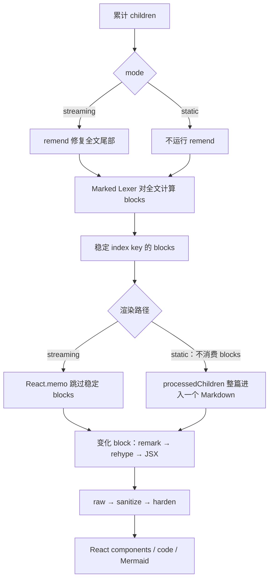

# 第 5 章 Streamdown：全文修复、词法分块与块级复用

> 仓库：[`vercel/streamdown`](https://github.com/vercel/streamdown)  
> 固定 commit：[`e5deed330aa4231751a106445d93d62e4716a22f`](https://github.com/vercel/streamdown/commit/e5deed330aa4231751a106445d93d62e4716a22f)  
> 本轮版本：`streamdown 2.5.0`、`remend 1.3.0`、`@streamdown/code 1.1.1`  
## 本章要解决的问题

如果完整 Markdown 语义和插件生态不能放弃，怎样至少让已完成部分停止重复执行昂贵 transform 与 React render？Streamdown 用全文修复、全文 lex 和稳定 block 复用回答这个问题。

## 本章目标

| 项目 | 内容 |
|---|---|
| 前置知识 | 第 1–4 章 |
| 本章重点 | `remend`、Marked block lexer、stable key、memo 与 static transition |
| 第一遍重点 | streaming 主路径、block split、`MemoizedMarkdownBlock` |
| 完成后应能回答 | 全文扫描与局部复用如何同时存在？static mode 清除了哪些临时语义？ |

## 核心心智模型

Streamdown 不是增量 Markdown parser。默认 streaming 且开启 `parseIncompleteMarkdown` 时，它每次对累计全文执行 `remend`；随后所有模式都会运行 Marked lexer。稳定 block key、`React.memo` 与 processor/highlighter cache 再把昂贵的 unified、React 和高亮工作尽量限制在变化的末尾 block。



## 核心源码原文：全文修复与全文分块

以下是固定 commit 中两个位置的原样关键语句；空行表示省略了两段之间的预处理代码：[预处理 L509-L516](https://github.com/vercel/streamdown/blob/e5deed330aa4231751a106445d93d62e4716a22f/packages/streamdown/index.tsx#L509-L516)、[分块 L543-L546](https://github.com/vercel/streamdown/blob/e5deed330aa4231751a106445d93d62e4716a22f/packages/streamdown/index.tsx#L543-L546)。

```tsx
let result =
  mode === "streaming" && shouldParseIncompleteMarkdown
    ? remend(children, remendOptions)
    : children;

const blocks = useMemo(
  () => parseMarkdownIntoBlocksFn(processedChildren),
  [processedChildren, parseMarkdownIntoBlocksFn]
);
```

逐行理解：

- `mode === "streaming"`：只有流式模式才可能进入修复分支。
- `shouldParseIncompleteMarkdown`：即使 streaming，也允许显式关闭 `remend`。
- `remend(children, ...)`：传入的是当前累计全文，不是本次新增 chunk。
- `parseMarkdownIntoBlocksFn(processedChildren)`：分块器始终接收完整预处理结果。
- `[processedChildren, ...]`：文本增长会使 block 计算重新执行；这里没有复用旧 lexer state。

第二个关键节选说明 transition 只调度已经算好的 `blocks`：[源码 L554-L565](https://github.com/vercel/streamdown/blob/e5deed330aa4231751a106445d93d62e4716a22f/packages/streamdown/index.tsx#L554-L565)。

```tsx
if (mode === "streaming" && !animatePlugin) {
  startTransition(() => {
    setDisplayBlocks(blocks);
  });
} else {
  setDisplayBlocks(blocks);
}
```

- `startTransition` 包住的是 state 更新，不是 `remend` 或 lexer 计算。
- 动画插件启用时走同步 `setDisplayBlocks`；不能把 transition 描述成所有流式更新的固定路径。

## 1. 流式主路径

源码锚点：[`index.tsx L509-L583`](https://github.com/vercel/streamdown/blob/e5deed330aa4231751a106445d93d62e4716a22f/packages/streamdown/index.tsx#L509-L583)

```tsx
// 学习版等价伪代码
const processed = useMemo(() => {
  if (mode !== 'streaming') return children

  // 1. 输入是累计全文，不是本次新增 chunk。
  // 2. remend 每次重新检查整串，并修复不完整的尾部语法。
  return parseIncompleteMarkdown
    ? remend(children, remendOptions)
    : children
}, [children, mode, parseIncompleteMarkdown, remendOptions])

// 3. Marked lexer 仍读取完整 processed 字符串。
const blocks = parseMarkdownIntoBlocks(processed)

// 4. 仅普通 streaming 路径把 state 更新放入 transition；
//    static 或动画插件路径直接同步更新。
if (mode === 'streaming' && !animatePlugin) {
  startTransition(() => setDisplayBlocks(blocks))
} else {
  setDisplayBlocks(blocks)
}
```

关键理解：`remend` 和 block lexer 的成本仍随当前全文长度增长；`startTransition` 只改变调度优先级，不减少解析工作。

## 2. 为什么完成的段落通常不会重渲染

源码锚点：[`Block memo L327-L424`](https://github.com/vercel/streamdown/blob/e5deed330aa4231751a106445d93d62e4716a22f/packages/streamdown/index.tsx#L327-L424)、[`stable key L574-L583`](https://github.com/vercel/streamdown/blob/e5deed330aa4231751a106445d93d62e4716a22f/packages/streamdown/index.tsx#L574-L583)

```tsx
// 学习版等价伪代码
const Block = memo(BlockView, (prev, next) => {
  // block 内容和影响输出的关键配置未变化，就跳过 unified 与 React 重算。
  return prev.content === next.content
    && prev.isIncomplete === next.isIncomplete
    && prev.components === next.components
    && samePlugins(prev, next)
})

displayBlocks.map((content, index) => (
  <Block
    // key 不包含 content hash：末尾 block 继续增长时不会被卸载重建。
    key={`${instanceId}-${index}`}
    content={content}
  />
))
```

这是 Streamdown 最核心的性能设计：父层仍全文扫描，但完成的 block 通常不再进入 unified/JSX。它假设内容主要是尾部追加；若在中间插入或删除 block，index key 可能把有内部状态的自定义 block 与新的语义内容对应起来。

固定 commit 还有一个必须单独记录的外层 memo 风险：最外层 `Streamdown` 自身也使用自定义 [`React.memo` comparator](https://github.com/vercel/streamdown/blob/e5deed330aa4231751a106445d93d62e4716a22f/packages/streamdown/index.tsx#L853-L869)，但比较字段没有覆盖 `components`、`remarkPlugins`、`rehypePlugins`、`allowedTags`、`remend`、`parseIncompleteMarkdown`、`controls` 等 props。若只修改这些遗漏配置、而已比较字段均不变，整个组件可能被错误跳过，Block comparator 根本收不到新配置。因此，“保持引用稳定可提高 Block 命中率”只适用于外层已经重新 render 的情况；动态配置必须在集成测试中验证。这是源码推断，本文没有把它写成已复现 bug。

## 3. 分块不是普通的 `split('\n\n')`

源码锚点：[`parse-blocks.tsx L96-L182`](https://github.com/vercel/streamdown/blob/e5deed330aa4231751a106445d93d62e4716a22f/packages/streamdown/lib/parse-blocks.tsx#L96-L182)

```ts
// 学习版等价伪代码
function parseMarkdownIntoBlocks(markdown: string) {
  // 源码先在 raw markdown 上识别 footnote；命中时直接返回，不启动 lexer。
  // Footnote definition/reference 必须处于同一个 mdast，无法安全拆开。
  if (containsFootnote(markdown)) return [markdown]

  const tokens = MarkedLexer.lex(markdown, { gfm: true })

  // 未闭合 HTML 和 $$ 数学块可能被 lexer 分成多个 token，需重新合并。
  return mergeOpenHtmlAndMathTokens(tokens)
}
```

Footnote 文档会退化为整篇单 block，从而失去“只重算末块”的主要收益。这是正确性优先于局部复用的明确取舍。

## 4. `remend` 如何处理未闭合语法

源码锚点：[`remend options/handlers L49-L124`](https://github.com/vercel/streamdown/blob/e5deed330aa4231751a106445d93d62e4716a22f/packages/remend/src/index.ts#L49-L124)、[`handler execution L274-L307`](https://github.com/vercel/streamdown/blob/e5deed330aa4231751a106445d93d62e4716a22f/packages/remend/src/index.ts#L274-L307)

```ts
// 学习版等价伪代码
function remend(markdown, options) {
  let result = markdown

  // 顺序很重要：先处理会影响后续定界符解释的结构。
  for (const handler of orderedHandlers(options)) {
    result = handler(result)
  }

  // 示例策略：
  // - 未闭 bold/italic/code/strike：临时补结束 delimiter。
  // - partial image：暂时移除，避免请求半截 URL。
  // - incomplete link：写入专用占位 URL。
  // - inline $ math 默认不修复，避免把货币误判成公式。
  return result
}
```

`remend` 是字符串预处理器，不是容错 AST parser。流结束后应使用 `mode="static"`，让未经 remend、但仍经过 literal/custom tag 预处理的 `processedChildren` 重新整篇解析，避免临时修复语义继续存在。

## 5. Static mode 不是 `isAnimating=false`

源码锚点：[`static branch L758-L798`](https://github.com/vercel/streamdown/blob/e5deed330aa4231751a106445d93d62e4716a22f/packages/streamdown/index.tsx#L758-L798)

```tsx
// 学习版等价伪代码：当前实现的 blocks 计算发生在 static return 之前。
const processedChildren = mode === 'streaming'
  ? remendAndPreprocess(children)
  : preprocessLiteralAndCustomTags(children) // static 默认不 remend

const blocks = parseMarkdownIntoBlocks(processedChildren)

if (mode === 'static') {
  // 不采用分块式输出，也不使用 transition；整篇保持一个统一 AST。
  // 注意：当前实现仍已计算上面的 blocks，只是这里不消费它。
  return <Markdown>{processedChildren}</Markdown>
}
```

在 streaming mode 中，即使 `isAnimating=false`，默认仍会执行未闭合修复。已完成文章应显式切换 `mode="static"`。Static 省掉的是 remend、分块式 React 输出与 transition，并不等于当前源码完全没有 block-lexer 计算；另外最终输入是经过 literal/custom tag 预处理的 `processedChildren`，不是未经处理的原始字符串。

## 6. Unified processor cache

源码锚点：[`markdown.ts L66-L184`](https://github.com/vercel/streamdown/blob/e5deed330aa4231751a106445d93d62e4716a22f/packages/streamdown/lib/markdown.ts#L66-L184)、[`processor pipeline L202-L232`](https://github.com/vercel/streamdown/blob/e5deed330aa4231751a106445d93d62e4716a22f/packages/streamdown/lib/markdown.ts#L202-L232)

```ts
// 学习版等价伪代码
const processorCache = new LruMap({ max: 100 })

function getProcessor(remarkPlugins, rehypePlugins, options) {
  const key = serializePluginNamesAndOptions(remarkPlugins, rehypePlugins, options)
  const cached = processorCache.get(key)
  if (cached) return cached

  const created = createProcessor()
  processorCache.set(key, created)
  return created
}

function createProcessor() {
  return unified()
    .use(remarkParse)
    .use(remarkPlugins)
    .use(remarkRehype)
    .use(rehypePlugins)
}
```

缓存的是“配置完成的 processor”，不是 AST 或渲染结果。源码使用函数 `name` 构造部分 key；同名但行为不同的插件存在理论碰撞，这是源码推断，不是本轮已复现 bug。

## 7. 代码高亮为何不会阻塞首帧

源码锚点：[`CodeBlock L30-L111`](https://github.com/vercel/streamdown/blob/e5deed330aa4231751a106445d93d62e4716a22f/packages/streamdown/lib/code-block/index.tsx#L30-L111)、[`@streamdown/code L99-L249`](https://github.com/vercel/streamdown/blob/e5deed330aa4231751a106445d93d62e4716a22f/packages/streamdown-code/index.ts#L99-L249)

```tsx
// 学习版等价伪代码
<Suspense fallback={<PlainCode code={code} />}>
  <LazyHighlightedCode code={code} language={language} />
</Suspense>

// 高亮插件内部：
// 1. language + theme 复用 Shiki highlighter Promise。
// 2. 同一 code 的并发请求合并为 subscribers。
// 3. 未知或流式截断的语言名回退为 text。
```

默认实现会立即显示纯文本 code，再异步替换成 Shiki token。`isIncomplete` 会传给 custom renderer，但默认高亮 body 并不会因此自动停止高亮；若流式代码很长，应在自定义 renderer 中利用该状态做延迟策略。

## 8. 安全模型

源码锚点：[`default security L238-L268`](https://github.com/vercel/streamdown/blob/e5deed330aa4231751a106445d93d62e4716a22f/packages/streamdown/index.tsx#L238-L268)、[`official security guide`](https://github.com/vercel/streamdown/blob/e5deed330aa4231751a106445d93d62e4716a22f/apps/website/content/docs/security.mdx#L24-L50)

默认链路是：

```text
rehype-raw → rehype-sanitize → rehype-harden → React
```

- sanitize 是 raw HTML/XSS 主防线。
- harden 的默认外部资源策略偏宽松；不可信内容应收紧 protocol、link/image prefix 与 data image。
- `linkSafety=true` 默认通过确认弹窗处理未知链接。
- 自定义 `rehypePlugins` 会替换默认数组；漏掉 sanitize 会主动放弃主防线。

## 9. SSR、测试与 benchmark 证据边界

### SSR / 运行时

`streamdown` 主入口第一行是 [`"use client"`](https://github.com/vercel/streamdown/blob/e5deed330aa4231751a106445d93d62e4716a22f/packages/streamdown/index.tsx#L1-L1)。它可以出现在 SSR 应用中并参与服务端生成/客户端 hydration，但 API 本身是 Client Component，不应描述成无需客户端运行时的 React Server Component renderer。官方还单独记录了 [Vite SSR 的 CSS bundling 配置](https://github.com/vercel/streamdown/blob/e5deed330aa4231751a106445d93d62e4716a22f/apps/website/content/docs/faq.mdx#L42-L55)；Mermaid、复制、下载、链接弹窗等浏览器能力也需要逐项评估。

### 测试证据

- Code fence 测试覆盖不同 fence 长度、缩进、混合 fence 与 inline false positive。[测试 L8-L108](https://github.com/vercel/streamdown/blob/e5deed330aa4231751a106445d93d62e4716a22f/packages/streamdown/__tests__/incomplete-code-block.test.tsx#L8-L108)
- Mode 测试覆盖 streaming/static 以及只把最后 block 标记 incomplete。[测试 L216-L328](https://github.com/vercel/streamdown/blob/e5deed330aa4231751a106445d93d62e4716a22f/packages/streamdown/__tests__/incomplete-code-block.test.tsx#L216-L328)
- Link safety 测试覆盖同步/异步 safelist 与 incomplete link。[测试 L43-L132](https://github.com/vercel/streamdown/blob/e5deed330aa4231751a106445d93d62e4716a22f/packages/streamdown/__tests__/link-safety.test.tsx#L43-L132)

本轮没有安装该仓库依赖并执行完整测试套件，因此这里只陈述测试设计，不声称当前 checkout 已通过。

### Benchmark 证据

确定事实：

- 默认 streaming 且开启 `parseIncompleteMarkdown` 时，每次新内容会对累计全文执行 `remend`；Marked lexer 则在所有模式下执行。
- 已完成 block 通常能跳过 unified/React 重渲染。
- processor LRU 最大 100；Shiki highlighter/token 另有 module-level cache。

源码推断：若服务端每个 token 都触发一次 UI 更新，全文扫描的累计成本可能接近二次增长。实际应用应在传输/UI 层按帧或时间窗口合并 token，并用自己的消息长度、插件和高亮负载做 Profiler/Performance 测试。仓库 benchmark 只有 harness，没有固化结果，因此不能据此宣称 Streamdown 已被实测证明快于其它库。[benchmark harness](https://github.com/vercel/streamdown/blob/e5deed330aa4231751a106445d93d62e4716a22f/packages/streamdown/__benchmarks__/streamdown-vs-react-markdown.bench.ts#L174-L405)

## 10. 低版本浏览器与 iOS

Streamdown 不会探测旧浏览器并自动从 `streaming` 切换到 `static`。只要宿主持续更新 `children`、React 主链能够执行，它仍按正常流式路径更新；如果 Fetch Streaming 不可用，是否等待完整 `response.text()` 再传入组件，完全由宿主决定。

固定源码中直接使用 [`Object.hasOwn`](https://github.com/vercel/streamdown/blob/e5deed330aa4231751a106445d93d62e4716a22f/packages/streamdown/lib/markdown.ts#L248-L260)，另有 `.at()` 调用；没有相应 polyfill 时可能在 render 阶段抛错，而不是自动等待 final。延迟渲染 hook 对 `requestIdleCallback` 提供 `setTimeout` fallback，但直接实例化 [`IntersectionObserver`](https://github.com/vercel/streamdown/blob/e5deed330aa4231751a106445d93d62e4716a22f/packages/streamdown/hooks/use-deferred-render.ts#L181-L204)，因此 Mermaid 等可选路径也需要单独降级。

推荐策略：传输层不支持增量读取时显示 skeleton，完整响应到达后以 `mode="static"` 渲染；现代 renderer 加载失败时由 ErrorBoundary 回退到纯文本 `<pre>`。不要把空白当作兼容方案，也不要为了兼容而绕过 sanitize。

## 11. 最适合的场景

- React AI 消息与研究报告草稿。
- 需要 GFM、数学、Mermaid、Shiki、链接确认等完整体验。
- 内容主要尾部追加，完成后能显式切换 static mode。

不应默认选择的情况：极端长文、字符级高频更新且 parser CPU 已是主要瓶颈；此时应比较 markstream-react 的 parser/node reuse，或在上层批量提交。

## 本章练习

实现一个累计全文 renderer：每次先把完整文本分成顶层 block，只重算最后变化 block；为完成 block 加一个昂贵的模拟插件并记录执行次数。

### 练习验收

- 尾部增长不会让完成 block 重跑插件；
- 改变 plugin/options 会使相关 cache 正确失效；
- streaming→static 后临时补全消失，final 结果与完整解析一致。

## 检查理解

1. `remend`、Marked lexer 和 block memo 各自减少或增加什么工作？
2. stable key 为什么不能只使用数组下标？
3. processor/highlighter cache 的 key 必须包含哪些配置？

## 本章小结

Streamdown 的关键不是“增量 parser”，而是把昂贵工作限制在变化 block。下一章继续下沉到 token、结构节点和 React node 三层。

---

[上一章：Ant Design X Markdown](04-ant-design-x-markdown.md) · [课程目录](00-learning-guide.md) · [下一章：markstream-react](06-markstream-react.md)
