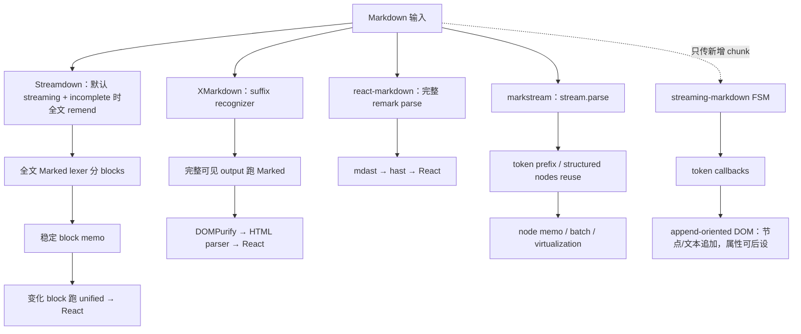

# 第 7 章 流式 Markdown Renderer 的五种架构

> 本章在完成六个源码案例后阅读。固定提交、测试与 benchmark 证据见[源码证据附录](../streaming-markdown-renderers-research.md)。

## 本章要解决的问题

六个项目使用了相同的“流式 Markdown”名称，却把增量发生在完全不同的层。怎样用统一坐标系比较它们，而不是依赖 API 名称、社区热度或单次 benchmark 排名？

## 本章目标

- 用输入合同、状态保存层、稳定 identity、未闭语法和 final 语义比较实现。
- 区分减少计算、复用输出与改变调度优先级。
- 能根据同一份可测 worksheet 做工程选型，并明确证据缺口。

## 1. 核心心智模型

“流式 Markdown”至少包含四个不同问题：

- 能消费不断增长的字符串，不等于增量 parser。
- `useMemo` 缓存 Parser/processor 实例，不等于缓存 AST。
- `startTransition` 只改变 React 调度优先级，不减少解析工作。
- 打字动画和平滑提交不等于网络流，也不等于 parser state。
- sanitize、URL allowlist、外链确认分别解决不同安全问题。

## 2. 六个包各自解决什么

六个项目承担不同的教学角色；比较重点是成本与状态发生在哪一层。

| 包 | 核心定位 | 真正复用的层 | 最明显的限制 |
|---|---|---|---|
| Streamdown | AI Markdown 成品 renderer | 完成 block 的 unified/React；processor/highlighter 实例 | 默认 streaming 开启 incomplete parsing 时全文 `remend`；所有模式全文 lex |
| Ant Design X Markdown | Ant Design 体系的流式尾部稳定器 | 新增 suffix 的 incomplete recognizer；Parser/Renderer 实例 | 每次整段 Marked + sanitize + HTML→React |
| react-markdown | unified React 标准基线 | Hooks 版可复用 processor 配置 | `children` 变化仍全文 parse/run |
| Marked | Markdown→HTML 编译器 | 单次 parse 内的 tokenizer/renderer 扩展 | 不管理 stream、React 或 sanitize |
| markstream-react | 长流与长文 React renderer | token prefix、structured node、React node 三层 | beta；复杂配置会关闭快速路径 |
| streaming-markdown | 逐字符增量 parser + DOM renderer | 跨 chunk parser state；节点/文本主要追加，属性可后设 | 语法/生态较窄，URL 安全需自建 |

## 3. 五种渲染架构

Marked 是其它 renderer 可使用的底层 compiler，因此图中单独放在 XMarkdown/Streamdown 的内部位置，而不作为第六条 UI 管线。

## 4. 流式与非流式行为

| 包 | 流式阶段 | 完成阶段 |
|---|---|---|
| Streamdown | `mode="streaming"`：修复、分块、末块更新 | 应显式 `mode="static"`：`processedChildren` 整篇统一输出；当前实现仍提前计算 blocks，但不采用分块式渲染 |
| XMarkdown | `hasNextChunk=true`：启用 suffix cache 与 pending/loading | `false`：同步使用完整 input，但下游仍是同一全量 HTML 管线 |
| react-markdown | 无专用阶段；当前前缀被视为完整文档 | 同一管线 |
| Marked | 无专用阶段；每次完整 compiler | 同一管线 |
| markstream-react | 默认 `streamParse=auto + final=false`：stream parse 与 node reuse | 默认 auto 在 `final=true` 回退完整语义并 reset；显式 `streamParse:true` 仍可继续 stream parse |
| streaming-markdown | 持续 `parser_write(newChunk)`，token 可保持开放 | `parser_end` 仅在有 pending 时追加换行触发 flush；不 reset、不显式关闭全部 token，也不全量重解析 |

## 5. 未闭语法策略

| 包                       | 策略                                                        | UI 特性                                |
| ----------------------- | --------------------------------------------------------- | ------------------------------------ |
| Streamdown              | 临时补 delimiter、移除 partial image、占位 incomplete link         | 当前尾部尽量像完整 Markdown                   |
| XMarkdown               | pending 暂时隐藏，或生成 `incomplete-*` loading component         | 可以为半个链接/表格/HTML 显示专用骨架               |
| react-markdown / Marked | 把当前前缀当成一篇完整文档正常解释                                         | 结构可能随新字符反复变化                         |
| markstream-react        | stream parser 加多类 tail ambiguity 修复；默认 auto 在 final 时完整解析 | 容错与最终语义分离；显式 `streamParse:true` 是例外  |
| streaming-markdown      | optimistic：看到起点就打开 token，跨 chunk 保持状态                     | 样式立即出现；旧 subtree 不替换，但链接/图片属性会在闭合时后设 |

## 6. 性能模型

以下是基于源码控制流的复杂度方向，不是跨库实测排名：

| 包 | 每次更新的前半段工作 | 后半段复用 |
|---|---|---|
| Streamdown | 默认 streaming 开启 incomplete parsing 时全文修复；所有模式全文 lex | 通常只变化 block 跑 unified/React |
| XMarkdown | recognizer 只扫 suffix；随后全文编译/清洗/HTML→React | 没有 completed-block cache |
| react-markdown | 全文 mdast/hast transforms | React 自身 reconciliation |
| Marked | 全文 lexer + parser | 无 UI 层 |
| markstream-react | stream parser 尝试 append/tail 复用 | 稳定 nodes、memo、batch、virtualization |
| streaming-markdown | 只处理新增字符 | 旧 DOM 不重建 |

若每个 token 都提交一次累计全文，Streamdown、XMarkdown、react-markdown、Marked 的累计前半段工作都可能显著增长。实际产品应先在 transport/UI 层合并 token，再用真实插件、高亮器和消息长度测量。

跨库数字只有在输入、chunk 节奏、插件、重组件、React 提交和设备一致时才可比较。具体仓库 benchmark 的可复现性核查放在[源码证据附录](../streaming-markdown-renderers-research.md#25-性能证据审计benchmark-表格不能当结果)；正文只保留这套判断方法。

## 7. 安全模型

| 包 | Raw HTML | URL / 外链 | 必须注意 |
|---|---|---|---|
| Streamdown | 默认 raw→sanitize→harden | 默认 link confirmation；harden 外部资源策略偏宽松 | 自定义 rehypePlugins 会替换默认安全链 |
| XMarkdown | Marked HTML 后 DOMPurify | 可通过组件/config 扩展 | 自定义 tags/config/components 改变责任边界；固定 commit 无 DOM 返回 `null` |
| react-markdown | 默认不执行 raw HTML | 默认安全协议 allowlist | 加 `rehype-raw` 后应同时加 sanitize |
| Marked | 直接产生 HTML，不 sanitize | 由调用方处理 | 必须在插入 DOM 前清洗 |
| markstream-react | 有 link validation 与 `htmlPolicy` | 按策略/组件配置 | 可选图表、高亮与 trusted HTML 扩大攻击面 |
| streaming-markdown | 正文使用 `createTextNode`，一般 HTML 不解析 | URL 默认直接 `setAttribute` | 必须自建 scheme allowlist、图片与外链策略 |

## 8. SSR 与运行时边界

| 包                  | SSR / 运行时结论                                                              |
| ------------------ | ------------------------------------------------------------------------ |
| Streamdown         | 主入口含 `"use client"`；可用于 SSR 应用并 hydration，但不是无需客户端运行时的 RSC renderer      |
| XMarkdown          | 固定 commit 在 DOMPurify 不可用时返回 `null`，服务端不直接输出 Markdown HTML               |
| react-markdown     | 核心 unified→JSX 不依赖 DOM，适合 Node SSR；用户插件仍可能引入浏览器依赖                        |
| Marked             | 核心是 Node/浏览器均可运行的字符串 compiler；sanitize 由调用方选择运行位置                        |
| markstream-react   | 发布独立 `./server` export；客户端交互和 worker 能力仍应走对应入口                           |
| streaming-markdown | parser 可接自定义 renderer；默认 renderer 使用 `document` 与 HTMLElement，只适合浏览器 DOM |

## 9. 低版本浏览器与 iOS 降级

六个包都不会因为浏览器较旧而自动切换成“等待 Streaming 结束后再展示”。最终现象取决于失败层级：

| 失败层级 | 默认结果 | 正确的应用降级 |
|---|---|---|
| 只缺 Fetch Streaming | 宿主若直接调用 `getReader()` 会抛错；renderer 本身通常不知道 | skeleton/状态提示 → `response.text()` → final/static 一次渲染 |
| renderer 可运行，增强 API 缺失 | 可能只损失动画、虚拟化、Mermaid/Worker，也可能因未检测 API 而报错 | 关闭重组件，代码/图表保留纯文本 fallback |
| bundle 语法或关键内建对象缺失 | 模块加载或 render 失败；CSR 可能空白 | legacy bundle + polyfill；ErrorBoundary 回退纯文本或 SSR HTML |
| hydration 失败但已有 SSR HTML | 旧 HTML 可能仍可见，后续流式更新停止 | 保留服务端输出，明确提示实时更新不可用 |

共同使用六包时，无 polyfill 的保守基线建议取 iOS/Safari 15.4+、Chrome 93+：X Markdown 官方矩阵从 Safari 15.4 / Chrome 92 开始，但 Streamdown/react-markdown 等源码还使用 `Object.hasOwn`，Chrome 93 更稳妥。[X Markdown 兼容矩阵](https://github.com/ant-design/x/blob/b529d8e96d5b35fe81ec68922fedb1ea124c7235/packages/x-markdown/README-zh_CN.md#L47-L55) [Object.hasOwn](https://developer.mozilla.org/en-US/docs/Web/JavaScript/Reference/Global_Objects/Object/hasOwn) [Array.at](https://developer.mozilla.org/en-US/docs/Web/JavaScript/Reference/Global_Objects/Array/at)

低版本 iOS 上的 Chrome 应按系统 WebKit/iOS 能力验证，而不是套用桌面 Chrome 的 Blink 版本。Apple 的替代引擎机制只在较新的系统、地区和 entitlement 条件下开放；传统低版本 iOS 不具备这个假设。[Apple BrowserEngineKit 说明](https://developer.apple.com/support/alternative-browser-engines/)

完整流程、每包失败语义和 capability-detection 代码见[低版本浏览器与 iOS 专题](./08-legacy-browser-compatibility.md)。

## 10. 代码高亮和重组件

- Streamdown：纯文本同步 fallback；Shiki lazy/highlighter cache/token cache；custom renderer 可读取 `isIncomplete`。
- XMarkdown：核心只提供 `lang/block/loading` 元数据；Ant Design X 的独立 `CodeHighlighter` 使用 PrismLight 与按语言 lazy cache。
- react-markdown：通过 `components.code` 自行接入高亮器，不知道流是否完成。
- Marked：renderer extension 只产生 HTML；缓存与异步 UI 由上层负责。
- markstream-react：集成 Shiki/Monaco、Mermaid/D2 等更完整，但也带来最大状态与依赖面。
- streaming-markdown：只写 language class；高亮更新策略完全由自定义 renderer 决定。

对流式 code/Mermaid，最重要的通常不是“支持什么插件”，而是能否在结构未完成时推迟昂贵计算，并保留同步 fallback。

## 11. 选型决策

| 首要约束                               | 推荐                 | 原因                                                |
| ---------------------------------- | ------------------ | ------------------------------------------------- |
| React AI 对话，开箱即用，语法丰富              | Streamdown         | 流式修复、块 memo、安全链接和重组件配套最均衡                         |
| 已在 Ant Design X 体系                 | XMarkdown          | loading component、tail、code 状态与 Ant Design 组件协作自然 |
| 超长输出、高节点数、parser 与 React 都是瓶颈      | markstream-react   | 唯一同时下沉到 token/node/view 三层复用的 React 候选            |
| 静态 Markdown、SSR、remark/rehype 生态   | react-markdown     | 管线成熟、默认 HTML/URL 边界清晰                             |
| 只需要 Markdown→HTML compiler         | Marked             | 低层、直接、扩展能力强；自行负责 sanitize/UI                      |
| 真正新增 chunk API、append-oriented DOM | streaming-markdown | parser state 最纯粹；接受属性后设、较窄语法和自建安全层                |

## 12. 如果自己设计一个 renderer

建议组合这些设计：

1. 明确 `streaming → final/static` 生命周期，final 必须消除临时修复语义。
2. 传输层先正确还原字节/事件边界，再把累计正文或新增 chunk 交给 renderer。
3. parser 能增量最好；否则至少稳定顶层 block/node identity。
4. 完成节点必须能跳过 AST transform 与 React render。
5. 重组件应有 raw fallback、lazy load、并发合并、未知语言回退和 incomplete/final gate。
6. cache key 应包含真正影响输出的 identity/options/content，且设计 eviction。
7. HTML sanitize、URL allowlist、外链确认、图片代理与 CSP 分层实现。
8. 测试随机 chunk、逐字符 chunk、非前缀改写、final reset、危险输入和稳定 node identity。

## 本章练习

使用统一 worksheet 对同一份 corpus 做实测，再选择架构：

| 字段 | 记录内容 |
|---|---|
| source length / chunk count | 输入规模与提交频率 |
| parse invocations / characters scanned | parser 工作量 |
| transformed blocks / stable blocks reused | 结构层复用 |
| React commits | UI 提交次数 |
| heavy-component executions | 高亮、图表、数学执行次数 |
| p50 / p95 duration | 同一设备上的延迟分布 |

估算可以用于设计实验，不能替代最终结论。

### 练习验收

- 选择依据来自 worksheet 的可重复数据，不来自库名或单次 benchmark；
- 明确 streaming/final、reset、安全和浏览器降级合同；
- 至少写出一个会使当前选择失效的负载变化。

## 检查理解

1. 六个包为什么归纳为五种 UI 架构？
2. 哪些方案减少 parser 工作，哪些只减少后续渲染工作？
3. 未闭语法策略为什么会影响 final correctness？
4. “最快”为什么不能脱离 chunk 调度、插件和设备定义？

## 本章小结

选型的核心是定位成本和状态：网络、尾部稳定、parser、AST/React、DOM 与重组件必须分层判断。下一章处理这些架构在旧浏览器和能力缺失时的退化。

---

[上一章：markstream-react](06-markstream-react.md) · [课程目录](00-learning-guide.md) · [下一章：兼容与降级](08-legacy-browser-compatibility.md)
