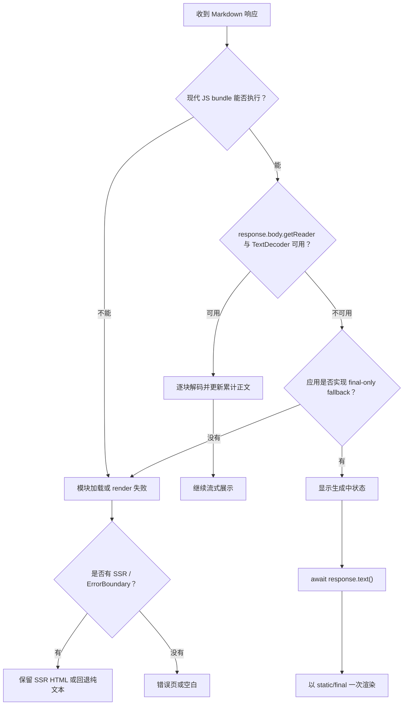

# 第 8 章 低版本浏览器与 iOS：能力检测、final-only 与非空白降级

> 证据范围：沿用主报告的 6 个固定 commit。这里讨论浏览器能力不足时会发生什么，不把 Node `engines` 当作浏览器最低版本。

## 本章要解决的问题

流式 renderer 正确并不代表旧浏览器能加载 bundle、读取响应流或运行重组件。本章把传输、语法、DOM、增强能力和 hydration 的失败分开处理。

## 本章目标

| 项目 | 内容 |
|---|---|
| 基础降级路线 | 第 1–2 章后可读：final-only、纯文本 fallback、非空白兜底 |
| 完整比较路线 | 完成第 1–7 章：比较六种实现的能力矩阵和方案级降级 |
| 本章重点 | capability detection、final-only、ErrorBoundary、纯文本与 SSR fallback |
| 第一遍重点 | 决策流程、能力矩阵、final-only 代码 |
| 完成后应能回答 | 为什么库不会自动等待 final？如何保证任何失败层都不白屏？ |

第一次只为产品补兜底时，阅读决策流程、final-only、ErrorBoundary 和练习的 MVP 部分即可；六包矩阵不是基础路线的先修。

## 核心心智模型

这六个库都不会检测到旧浏览器后自动等待流结束。只有应用主动识别传输能力、缓存完整正文并切换 final/static，用户才会看到“生成中 → 完成后一次展示”；没有 fallback 时，更可能是异常、保留旧内容或空白。

## 1. 决策流程



关键点是把兼容性拆成三层：传输层决定能否逐块拿到文本；renderer 层决定当前字符串或 chunk 如何变成 UI；Mermaid、Worker、高亮、动画等增强层应独立降级。

## 2. 六包行为矩阵

| 包 | 支持环境内收到 chunk | 低版本关键边界 | 没有应用 fallback 时 |
|---|---|---|---|
| Streamdown | `children` 更新后重新分块，streaming 通过 transition 提交 blocks | React 18/19；`Object.hasOwn`、`.at()`；延迟路径使用 `IntersectionObserver` | 主链兼容时继续流式；关键 API/bundle 不兼容时异常或空白 |
| X Markdown | `hasNextChunk: true` 时处理新增后缀并重建全文输出 | 官方 Chrome ≥92、Safari ≥15.4；DOMPurify/DOM 环境 | 首次 streaming state 可能短暂空一帧；不支持环境可能异常；无 DOM 时可返回 `null` |
| react-markdown | 每次完整 `children` 都同步解析当前快照 | 现代浏览器；固定源码使用 `Object.hasOwn` | 宿主逐批更新就逐次展示；库不会替宿主缓存网络流 |
| Marked | 每次 `parse(partialText)` 同步返回 HTML | `.at()`、现代语法；无明确 legacy build target | 脚本加载或执行失败；不会自动等待 final |
| markstream-react | `content` 更新后生成当前结构；`final` 控制收尾语义 | React ≥18、ES2019；重能力使用 Worker/Observer 等 | 可选调度 API 多数能退化；核心 bundle/React 不兼容仍会失败 |
| streaming-markdown | `parser_write(chunk)` 直接 append DOM/text | 原生 ESM/现代语法；默认 renderer 依赖 DOM | 第一次 write 前为空；写入后立即出现；加载/DOM 不兼容则异常 |

## 3. 兼容基线

如果六个包需要共用一套前端运行环境，无 polyfill 的保守下限建议是：

- iOS / Safari 15.4+
- Chrome 93+
- React 18+

原因是 X Markdown 官方支持 Safari 15.4、Chrome 92 起，[官方矩阵](https://github.com/ant-design/x/blob/b529d8e96d5b35fe81ec68922fedb1ea124c7235/packages/x-markdown/README-zh_CN.md#L47-L55)；但其它固定源码还使用 `Object.hasOwn` 和 `Array.prototype.at`，共同环境取 Chrome 93 更稳妥。[Object.hasOwn 兼容性](https://developer.mozilla.org/en-US/docs/Web/JavaScript/Reference/Global_Objects/Object/hasOwn) [Array.at 兼容性](https://developer.mozilla.org/en-US/docs/Web/JavaScript/Reference/Global_Objects/Array/at)

低版本 iOS 上的 Chrome 也应按系统 WebKit/iOS 版本测试。Apple 对替代浏览器引擎的开放有系统、地区和 entitlement 条件，最低涉及 iOS 17.4；不能用桌面 Chrome 的 Blink 能力推导传统低版本 iOS Chrome。[Apple 官方说明](https://developer.apple.com/support/alternative-browser-engines/)

## 4. Capability detection

不要只看 UA 字符串。传输能力应在拿到真实 `Response` 后检测：

```ts
function supportsModernMarkdownRuntime() {
  return (
    typeof Object.hasOwn === 'function' &&
    typeof Array.prototype.at === 'function'
  );
}

function supportsStreamingResponse(response: Response) {
  return (
    typeof ReadableStream !== 'undefined' &&
    typeof TextDecoder !== 'undefined' &&
    response.body !== null &&
    typeof response.body.getReader === 'function'
  );
}
```

`ReadableStream` 或 `TextDecoder` 的存在不保证服务端、代理和 Fetch 实现真的逐批交付，因此还应在目标设备上验证首 chunk 时间、chunk 数量和中断行为。[ReadableStream](https://developer.mozilla.org/en-US/docs/Web/API/ReadableStream) [TextDecoder](https://developer.mozilla.org/en-US/docs/Web/API/TextDecoder)

## 5. final-only 降级代码

```ts
async function consumeMarkdownResponse(
  response: Response,
  onChunk: (accumulated: string) => void,
  onComplete: (complete: string) => void,
) {
  if (!supportsStreamingResponse(response)) {
    // 旧浏览器明确走 final-only：界面先保留 skeleton/状态提示。
    const complete = await response.text();
    onComplete(complete);
    return;
  }

  const reader = response.body!.getReader();
  const decoder = new TextDecoder();
  let accumulated = '';

  for (;;) {
    const { value, done } = await reader.read();

    if (done) {
      accumulated += decoder.decode();
      onComplete(accumulated);
      return;
    }

    accumulated += decoder.decode(value, { stream: true });
    onChunk(accumulated);
  }
}
```

映射到各包：

| 包 | Streaming 可用 | final-only fallback |
|---|---|---|
| Streamdown | 更新累计 `children`，`mode="streaming"` | 完整正文 + `mode="static"` |
| X Markdown | 更新累计 input，`streaming={{ hasNextChunk: true }}` | 完整正文 + `streaming={{ hasNextChunk: false }}` |
| react-markdown | 批量更新累计 `children` | 完整后只 render 一次 |
| Marked | 批量 `parse(accumulated)` | 完整后 `parse()` + sanitize 一次 |
| markstream-react | 更新 `content`，保持 streaming 生命周期 | 完整正文 + `final: true` |
| streaming-markdown | 把新增 chunk 交给 `parser_write()` | 需要准备独立的静态 renderer |

## 6. 避免空白的产品兜底

至少实现以下三层：

1. **传输失败**：展示“当前浏览器将在生成完成后展示”，再走 `response.text()`。
2. **增强能力失败**：关闭 Mermaid、Monaco、Worker、动画和虚拟化；代码块使用 `<pre><code>`，图表显示源码。
3. **renderer 失败**：ErrorBoundary 保留 raw Markdown 纯文本；若已有 SSR HTML，不要在 hydration 失败时主动清空。

```tsx
function MarkdownFallback({ source }: { source: string }) {
  return (
    <section aria-live="polite">
      <p>富文本渲染不可用，已切换为纯文本。</p>
      <pre>{source}</pre>
    </section>
  );
}
```

运行时 polyfill 只能补内建对象，不能修复浏览器无法解析的现代语法。旧设备覆盖必须同时处理构建转译、依赖目标和运行时 polyfill。普通 Fetch polyfill 也可能把响应完整缓冲；如果旧浏览器仍必须实时显示，应考虑 XHR progress、WebSocket 或 SSE，并把收到的字符串交给 renderer。

## 本章练习

为课程第 9 章的 renderer 增加 capability detector：分别模拟缺少 ReadableStream、IntersectionObserver、Worker、现代 bundle 和 hydration。

### 练习验收

#### MVP（本地可完成）

- 用 capability mock 禁用 `ReadableStream`、Observer、Worker 和重组件，验证非空白 fallback。
- 验证首 chunk、连续 chunk、UTF-8 多字节拆分、取消和断网后的 UI。
- 禁用 `ReadableStream` 后，应看到状态提示和 final 内容，不能持续空白。
- 禁用 `IntersectionObserver`、Worker、Mermaid 后，正文仍应可读。
- renderer 主动抛错时，ErrorBoundary 应展示纯文本，并保留已收到内容。
- final 后重新执行完整、安全渲染；不要因兼容降级跳过 sanitize、URL allowlist 或 CSP。

#### 生产化扩展

- 最低目标 iOS Safari 与 iOS Chrome 都做真机测试；桌面模拟不能替代发布前设备矩阵。

## 检查理解

1. Fetch Streaming 缺失与 JavaScript bundle 无法执行为什么是两类故障？
2. polyfill、transpile 和 final-only 各自解决什么？
3. 为什么降级也不能绕过 sanitize 与 URL policy？

## 本章小结

兼容设计的目标不是保住全部动画和重组件，而是保住正文、安全和明确状态。完成本章后，用综合实践把输入合同、解析、复用和降级放进同一实现。

---

[上一章：架构比较](07-comparison.md) · [课程目录](00-learning-guide.md) · [下一章：核心综合实践](09-capstone-streaming-renderer.md)
