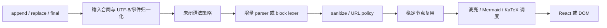

# 第 9 章 核心综合实践：实现最小流式 Markdown Renderer

> 先修章节：第 1–8 章。本实践不要求复刻任一项目，而是组合其中可迁移的机制。

## 本章要解决的问题

怎样把前八章的 parser、未闭语法、稳定节点、安全边界、重组件调度与兼容性知识，组合成一个可以被测试证明正确的最小 renderer？

## 本章目标

实现一个能够接收新增 chunk、显示未完成 Markdown、在 final 后恢复完整语义，并且可以解释缓存与安全边界的最小 renderer。

你可以选择两条实现路线：

- **状态机路线**：保存跨 chunk parser state，只消费新增字符；
- **稳定块路线**：接收累计全文，识别已完成 block，只重算变化尾部。

两条路线都必须显式处理 final、reset、安全和重组件调度。

## 本章练习：1. 先定义输入合同

```ts
type StreamEvent =
  | { type: "append"; chunk: string }
  | { type: "replace"; text: string }
  | { type: "final" }
  | { type: "reset" };
```

`append` 承诺输入只增长；`replace` 表示出现非前缀改写，必须重建解析状态。不要让同一个字符串参数同时隐含两种合同。

## 2. 定义运行时状态

```ts
type BaseState = {
  phase: "streaming" | "final";
  source: string;
  revision: number;
};

type RendererState =
  | (BaseState & {
      route: "incremental-parser";
      parserState: unknown;
    })
  | (BaseState & {
      route: "stable-blocks";
      stableBlocks: RenderBlock[];
      tail: RenderBlock | null;
    });
```

状态必须回答：

- parser 路线：哪些字符已经被 parser 消费？
- stable-blocks 路线：哪些 block 已完成且 identity 稳定？
- 当前 tail 使用了哪些临时补全或 optimistic token？
- final 后哪些临时结构必须重算？
- replace/reset 后哪些 cache 必须失效？

## 3. 建立最小管线



每一层只承担一种责任。sanitize 不能由 parser cache 代替，平滑动画也不能被描述成增量解析。

## 4. 选择未闭语法策略

至少实现两类：

- code fence：streaming 时展示纯文本或 incomplete code block，final 时完整解析；
- link/image：目标未闭合前不创建可点击或可请求的 URL。

记录临时语义的来源。final 阶段必须能够删除 placeholder、补 delimiter 或 optimistic attribute。

## 5. 保持稳定节点

稳定 identity 至少包含：

```ts
type BlockIdentity = {
  startOffset: number;
  kind: string;
  contentHash: string;
  outputConfigHash: string;
};
```

`outputConfigHash` 至少覆盖 parser options、插件、组件映射与安全 policy。任一项变化都不能继续复用旧输出；不要只用数组下标作为跨 revision identity。

## 6. 延迟重组件

对 Shiki、Mermaid、KaTeX 等重组件实现：

1. streaming 阶段同步纯文本 fallback；
2. block 完成后再 lazy load；
3. 同一内容和配置复用结果；
4. 新 revision 到达时取消或丢弃过期结果；
5. 未知语言或失败时保留原始文本。

## 7. 安全与兼容边界

- raw HTML 必须经过显式 policy；
- URL scheme 使用 allowlist，图片与外链策略分开；
- DOM 插入优先 text node，不信任 parser 产生的 HTML 字符串；
- 缺少 Fetch Streaming 时切到 `response.text() → final`；
- bundle 或 hydration 失败时保留纯文本或 SSR 内容，不能只剩空白。

## 8. 分层测试

### MVP 必做

#### Chunk invariance

同一文本采用整段、逐字符、随机 chunk 和 delimiter 边界切分，final 结果必须等价。

#### Streaming/final equivalence

streaming 阶段允许临时结构，但 `final` 后应与一次静态完整解析一致。

#### Reset

向 source 中间插入字符后发送 `replace`，旧 parser state 与 cache 不得继续使用。

#### Security

覆盖 `javascript:` URL、危险 raw HTML、未闭 image/link 与自定义组件。

### 正确性扩展

#### Stable prefix

尾部增长时，已完成 block 的 parser/plugin/render 计数不再增加。

### 生产化扩展

#### Compatibility

模拟缺少 streaming、ResizeObserver、Worker 或重组件加载失败，页面仍有非空白结果。

## 练习验收

### MVP 毕业线

- [ ] 可以画出 transport、parser、sanitize、view 和 heavy-component 五层边界；
- [ ] 能说明复用发生在 parser、token、block、React node 或 DOM 的哪一层；
- [ ] chunk-invariance 与 final-equivalence 测试通过；
- [ ] 非前缀改写会 reset；
- [ ] 危险 URL 和 raw HTML 有明确 policy；

### 正确性扩展

- [ ] 完成 block 不因尾部增长重复执行重插件；
- [ ] 固定 corpus 覆盖 code fence、emphasis、inline code、link 与随机 chunk；

### 生产化扩展

- [ ] 旧浏览器和增强能力失败时不会白屏；
- [ ] 能解释当前实现仍未解决的 CommonMark、性能或并发边界。

## 检查理解

1. 为什么“不断传入更长的字符串”不等于增量 parser？
2. processor/highlighter 实例缓存为什么不等于 AST 或输出缓存？
3. streaming 临时修复为什么必须在 final 阶段重新结算？
4. stable block identity 应包含哪些会影响输出的条件？
5. 如何证明一个优化减少了工作，而不是只改变调度时机？

## 本章小结

一个可信的流式 renderer 不由单一 parser 技巧构成，而是由输入合同、增量边界、临时语义结算、稳定 identity、安全策略和降级路径共同保证。只有 chunk invariance、final equivalence 与 stable-prefix 等测试同时成立，性能优化才没有破坏语义。

---

[上一章：浏览器兼容与降级](08-legacy-browser-compatibility.md) · [课程目录](00-learning-guide.md) · [返回入口](README.md)
