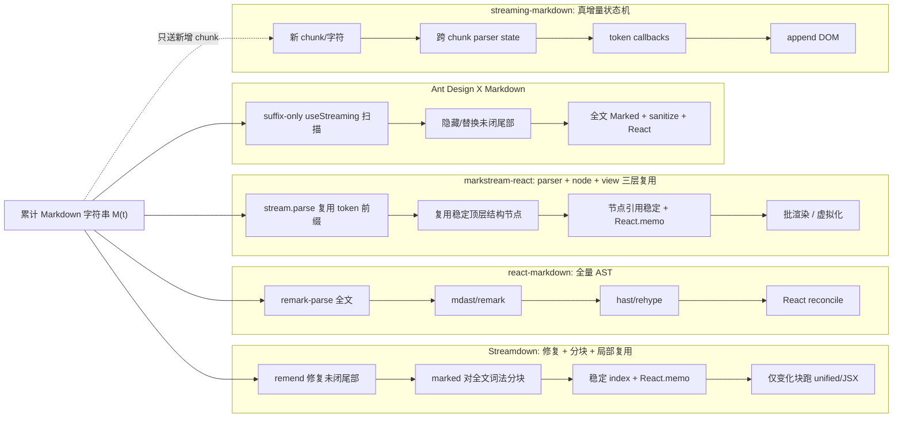
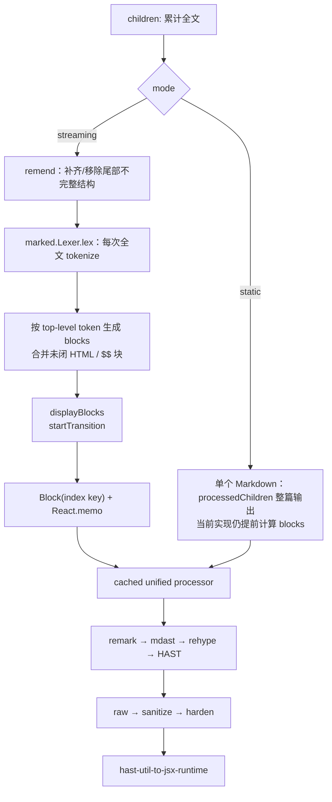
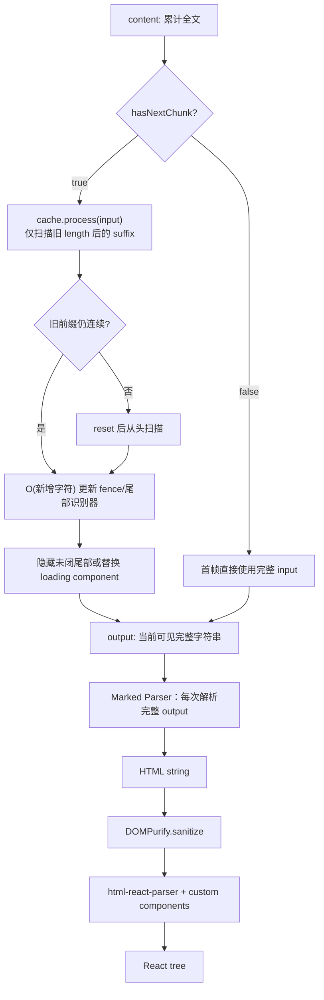
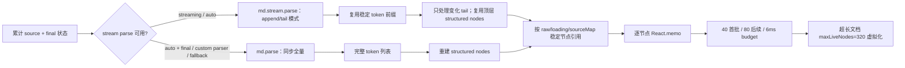

# 流式 Markdown 渲染器源码证据附录

> 调研日期：2026-07-31（Asia/Shanghai）  
> 证据边界：仅使用官方 GitHub 仓库源码、官方文档、仓库内 package metadata / tests / benchmarks，以及 GitHub 官方 REST API。所有源码结论尽量固定到 commit SHA 与行号；本文不把 README 宣称或 benchmark harness 当成实测性能结论。

> 本文保留完整源码证据、测试审计和风险分析，定位是“证据附录”，不是课程入口。请从[课程目录](./streaming-markdown-packages/README.md)开始，并在完成案例章后阅读[课程综合章](./streaming-markdown-packages/07-comparison.md)。

## 结论先行

五个 UI renderer 项目代表的并不是同一种“流式渲染”；另加 Marked 作为被上层复用的底层 compiler 对照：

1. **Streamdown** 是 React 里的“全文修复 + 全文词法分块 + 稳定块局部复用”。它不是增量 Markdown parser；在默认 streaming 且启用 `parseIncompleteMarkdown` 时，每次新文本会对整串做 `remend`，随后所有模式都会对整串执行 `marked.Lexer.lex`。稳定块索引和 `React.memo` 再把后续 unified/React 重活限制在变化块，已完成块通常可以复用。[全文修复与分块入口](https://github.com/vercel/streamdown/blob/e5deed330aa4231751a106445d93d62e4716a22f/packages/streamdown/index.tsx#L509-L583) [分块器每次全文 lex](https://github.com/vercel/streamdown/blob/e5deed330aa4231751a106445d93d62e4716a22f/packages/streamdown/lib/parse-blocks.tsx#L96-L182)
2. **Ant Design X Markdown** 是“增量尾部识别 + 全量输出重建”：`useStreaming` 只扫描新增 suffix，隐藏或替换未闭合语法；但每次可见输出变化仍对全文执行 Marked、DOMPurify 与 HTML→React。它优化了流式稳定性，不是增量 Markdown AST。[suffix cache](https://github.com/ant-design/x/blob/b529d8e96d5b35fe81ec68922fedb1ea124c7235/packages/x-markdown/src/XMarkdown/hooks/useStreaming.ts#L318-L365) [完整输出管线](https://github.com/ant-design/x/blob/b529d8e96d5b35fe81ec68922fedb1ea124c7235/packages/x-markdown/src/XMarkdown/index.tsx#L68-L125)
3. **react-markdown** 是成熟的非流式基线：每次同步渲染重新创建 processor、解析整串 Markdown、跑完整 mdast→hast→React 管线；异步 Hook 只 memo processor 配置，`children` 改变仍会重新 parse/run。[同步入口](https://github.com/remarkjs/react-markdown/blob/fda7fa560bec901a6103e195f9b1979dab543b17/lib/index.js#L163-L179) [Hook 缓存与 children 依赖](https://github.com/remarkjs/react-markdown/blob/fda7fa560bec901a6103e195f9b1979dab543b17/lib/index.js#L214-L251)
4. **markstream-react** 是更激进的 React 长流方案：底层 `stream-markdown-parser` 使用真正的 stream parse，并复用稳定顶层 token/node；React 层再稳定节点引用、逐节点 memo、批量渲染与虚拟化。它在复用粒度上最完整，但当前包仍为 beta，代码面与可选依赖显著更大。[stream parse 选择](https://github.com/Simon-He95/markstream-vue/blob/ec0f30735e1aefa6dd74d517732166e12eefa13a/packages/markdown-parser/src/parser/index.ts#L628-L650) [节点引用复用](https://github.com/Simon-He95/markstream-vue/blob/ec0f30735e1aefa6dd74d517732166e12eefa13a/packages/markstream-react/src/components/NodeRenderer.tsx#L71-L173)
5. **thetarnav/streaming-markdown** 是结构上最纯粹的增量 DOM 参照：跨 chunk 保留有限状态机与 token 栈，字符到达时直接触发 renderer 回调；节点/文本主要追加，但链接/图片闭合时会为已有元素后设属性。它牺牲了 CommonMark/unified 生态完整度，也没有默认 URL 协议过滤。[Parser 状态](https://github.com/thetarnav/streaming-markdown/blob/6beb92d991ed5a16f62cdfefac739b6eee45555f/smd.js#L179-L224) [逐字符 `parser_write`](https://github.com/thetarnav/streaming-markdown/blob/6beb92d991ed5a16f62cdfefac739b6eee45555f/smd.js#L468-L497) [属性后设](https://github.com/thetarnav/streaming-markdown/blob/6beb92d991ed5a16f62cdfefac739b6eee45555f/smd.js#L1149-L1154) [DOM renderer](https://github.com/thetarnav/streaming-markdown/blob/6beb92d991ed5a16f62cdfefac739b6eee45555f/smd.js#L1527-L1623)

因此，若目标是 React AI 对话 UI，默认优先顺序不是按 star 排名，而是：

- 需要未闭合语法容错、代码/数学/图表与安全链接 UX 的成品方案：优先 Streamdown。
- 已在 Ant Design X 体系内：先验证 X Markdown 在你的实际消息更新节奏下是否满足性能与语法稳定性，再决定是否引入 Streamdown。
- 超长 AI 输出、节点数量大且确实需要 parser/node/render 三层复用：评估 markstream-react，但先验证 beta API、bundle 与可选渲染器成本。
- 需要统一/remark 插件生态且内容通常一次性到齐：react-markdown 的管线更聚焦、扩展层次清晰。
- 需要真正新增 chunk API、append-oriented DOM、极低运行时依赖并愿意接受较窄语法/自建安全层：研究或采用 streaming-markdown 的 stateful renderer 模型。

## 项目身份与 star 快照

GitHub star 采集方法：在 2026-07-31（Asia/Shanghai）调用 GitHub 官方 REST `GET /repos/{owner}/{repo}`，记录响应的 `stargazers_count`。star 是仓库级、会持续变化；Ant Design X 的数字是整个 `ant-design/x` monorepo，不等于 X Markdown 单组件采用量。

| 项目 / 包 | 固定源码版本 | 2026-07-31 stars | 是否原生流式感知 | 纳入原因 |
|---|---:|---:|---|---|
| [`vercel/streamdown`](https://api.github.com/repos/vercel/streamdown) / `streamdown` | `e5deed3`，package `2.5.0` | 5,460 | 是，但不是增量 parser | React AI Markdown 的专用设计；同时覆盖未闭合修复、块复用、安全链接、Shiki、数学/Mermaid。[package metadata](https://github.com/vercel/streamdown/blob/e5deed330aa4231751a106445d93d62e4716a22f/packages/streamdown/package.json#L1-L23) |
| [`ant-design/x`](https://api.github.com/repos/ant-design/x) / `@ant-design/x-markdown` | `b529d8e`（调研 HEAD）；npm `2.9.0` 的 `gitHead` 为 `13afbf4` | 4,699（monorepo） | 是，增量识别未闭尾部；**输出仍全文重解析** | 用户指定的 Ant Design X 方案；其 suffix cache 会增量扫描新增字符，但每次可见输出仍走完整 Marked→HTML→sanitize→React。[package path](https://github.com/ant-design/x/blob/b529d8e96d5b35fe81ec68922fedb1ea124c7235/packages/x-markdown/package.json#L1-L24) |
| [`remarkjs/react-markdown`](https://api.github.com/repos/remarkjs/react-markdown) / `react-markdown` | `fda7fa5`，package `10.1.0` | 15,832 | 否 | 高星、成熟、插件化的 React 非流式基线；能区分“Markdown 渲染器”与“流式感知渲染器”。[package metadata](https://github.com/remarkjs/react-markdown/blob/fda7fa560bec901a6103e195f9b1979dab543b17/package.json#L50-L61) [version](https://github.com/remarkjs/react-markdown/blob/fda7fa560bec901a6103e195f9b1979dab543b17/package.json#L132-L146) |
| [`Simon-He95/markstream-vue`](https://api.github.com/repos/Simon-He95/markstream-vue) / `markstream-react` | `ec0f307`，package `0.0.56-beta.1`；parser `1.1.9` | 2,849 | **是，parser、结构节点与 React 三层复用** | 高星的进阶 React 对照；包含 stream parse、结构节点复用、平滑提交、批渲染和虚拟化，但仍是 beta。[package metadata](https://github.com/Simon-He95/markstream-vue/blob/ec0f30735e1aefa6dd74d517732166e12eefa13a/packages/markstream-react/package.json#L1-L49) |
| [`thetarnav/streaming-markdown`](https://api.github.com/repos/thetarnav/streaming-markdown) / `streaming-markdown` | `6beb92d`，package `0.2.15` | 386 | **是，真正 stateful incremental** | stars 较低但架构差异最大：零运行时依赖、逐字符状态机、append-oriented DOM，适合作为增量设计参照，而非按流行度推荐。[package metadata](https://github.com/thetarnav/streaming-markdown/blob/6beb92d991ed5a16f62cdfefac739b6eee45555f/package.json#L1-L29) |

另有 [`markedjs/marked`](https://api.github.com/repos/markedjs/marked)（37,024 stars，固定 commit `58ed4af`）值得作为底层引擎阅读，但不列为独立 React 渲染器：每次 `parse` 仍执行 preprocess→lexer→token walk→parser→postprocess 的完整编译链，并且官方明确不负责 HTML sanitize。[parse pipeline](https://github.com/markedjs/marked/blob/58ed4af62e7383ca770ac68aa987ca39887f33f3/src/Instance.ts#L275-L347) [security warning](https://github.com/markedjs/marked/blob/58ed4af62e7383ca770ac68aa987ca39887f33f3/README.md#L53-L56) 它在本文中的角色是 X Markdown 的全文 HTML compiler、Streamdown 的顶层 block lexer，而不是流式生命周期管理器。

## 先建立共同模型：四种成本发生在哪里

关键判别标准：

- **流式感知**：是否显式处理“输入还没结束”这一状态。
- **增量解析**：是否只消费新增 chunk，并保留 parser state；“每次拿累计全文重新 parse”不算增量解析。
- **增量渲染**：是否避免重做/重挂载已稳定区域；可以靠 append-oriented DOM，也可以靠稳定分块 + React memo 达成。
- **静态模式**：流结束后是否关闭修复/动画/不完整状态逻辑，回到标准 Markdown 语义。

## 1. Streamdown

### 1.1 流式与静态管线

`Streamdown` 的默认 `mode` 是 `streaming`，`parseIncompleteMarkdown` 默认打开。[props 默认值](https://github.com/vercel/streamdown/blob/e5deed330aa4231751a106445d93d62e4716a22f/packages/streamdown/index.tsx#L187-L232) 在 streaming mode 中，它先把整个 `children` 送入 `remend`，再把修复后的全文送入 `parseMarkdownIntoBlocks`；static mode 不运行 remend、transition 或分块式输出，而是把 `processedChildren` 整篇交给单个 `Markdown`。需要注意，当前实现的 `blocks` 计算位于 static return 之前，因此 static 仍会提前执行 block lexer，只是不消费 block-based render 结果。[两条分支](https://github.com/vercel/streamdown/blob/e5deed330aa4231751a106445d93d62e4716a22f/packages/streamdown/index.tsx#L509-L583) [static 输出](https://github.com/vercel/streamdown/blob/e5deed330aa4231751a106445d93d62e4716a22f/packages/streamdown/index.tsx#L758-L798)

分块器调用 `marked.Lexer.lex(markdown, {gfm: true})`，所以它仍是 O(累计全文) 的词法阶段；对 footnote 会退化为单 block，对尚未闭合的 HTML/`$$` 数学块会合并相邻 token，避免结构中途跳动。[分块实现](https://github.com/vercel/streamdown/blob/e5deed330aa4231751a106445d93d62e4716a22f/packages/streamdown/lib/parse-blocks.tsx#L96-L182)

每个 block 随后才进入真正渲染管线：缓存的 unified processor 依次跑 `remark-parse`、remark 插件/GFM、`remark-rehype`、`rehype-raw`、sanitize/harden，最终由 `hast-util-to-jsx-runtime` 生成 React elements。[processor 与 render](https://github.com/vercel/streamdown/blob/e5deed330aa4231751a106445d93d62e4716a22f/packages/streamdown/lib/markdown.ts#L186-L232) [HAST 到 JSX](https://github.com/vercel/streamdown/blob/e5deed330aa4231751a106445d93d62e4716a22f/packages/streamdown/lib/markdown.ts#L289-L351)

### 1.2 更新、memo 与 cache

- blocks 变化时，streaming mode 通常用 `startTransition` 更新 `displayBlocks`；若启用了 animated plugin，则同步更新，交给动画层控制。固定源码没有 `useDeferredValue`。[状态更新](https://github.com/vercel/streamdown/blob/e5deed330aa4231751a106445d93d62e4716a22f/packages/streamdown/index.tsx#L543-L566)
- block key 只用稳定 index，不含 content hash，因此末块增长不会造成 unmount/remount；`Block` 的 `React.memo` 比较 content、components、plugin 引用等，已完成且内容不变的块可以跳过重渲染。[memo comparator](https://github.com/vercel/streamdown/blob/e5deed330aa4231751a106445d93d62e4716a22f/packages/streamdown/index.tsx#L327-L424) [稳定 key](https://github.com/vercel/streamdown/blob/e5deed330aa4231751a106445d93d62e4716a22f/packages/streamdown/index.tsx#L574-L583)
- unified processor 是 module-global LRU，最大 100 项，以插件名和序列化 options 构造 key。[processor cache](https://github.com/vercel/streamdown/blob/e5deed330aa4231751a106445d93d62e4716a22f/packages/streamdown/lib/markdown.ts#L66-L184)
- 两个应在工程评审中记录的风险：processor key 使用函数 `name` 而不是函数 identity，同名不同实现存在理论碰撞；code token cache key 只取代码长度、前 100 与后 100 字符，同长度且首尾相同而中段不同的代码存在理论碰撞。后者可直接由 key 构造看出。[code token key](https://github.com/vercel/streamdown/blob/e5deed330aa4231751a106445d93d62e4716a22f/packages/streamdown-code/index.ts#L99-L126) 这两点是源码推断，未发现对应失败测试，不能写成已复现 bug。

### 1.3 未闭合语法容错

`remend` 是 raw-string preprocessor：按实现顺序补 bold、italic、inline code、strike、block math、link，并移除尾部 partial image/HTML；inline `$...$` 修复默认关闭，需要显式 opt-in。[修复入口与选项](https://github.com/vercel/streamdown/blob/e5deed330aa4231751a106445d93d62e4716a22f/packages/remend/src/index.ts#L49-L124) [尾部修复顺序](https://github.com/vercel/streamdown/blob/e5deed330aa4231751a106445d93d62e4716a22f/packages/remend/src/index.ts#L274-L307)

未闭链接会改写成 `streamdown:incomplete-link` 占位 URL；代码 fence 不是由 `remend` 补结束符，而是渲染最后一块时结合 fence 状态与 `isAnimating` 标记 `isIncomplete`。[末块不完整状态](https://github.com/vercel/streamdown/blob/e5deed330aa4231751a106445d93d62e4716a22f/packages/streamdown/index.tsx#L815-L843)

### 1.4 代码高亮、组件映射与扩展

代码块先同步显示 raw token fallback，再用 `React.lazy` + `Suspense` 加载高亮 body，避免异步高亮尚未完成时出现空白。[CodeBlock fallback](https://github.com/vercel/streamdown/blob/e5deed330aa4231751a106445d93d62e4716a22f/packages/streamdown/lib/code-block/index.tsx#L30-L111)

可选 `@streamdown/code` 使用 Shiki JavaScript regex engine；按 language + themes 缓存 highlighter Promise，对 token result 也有缓存并用 subscribers 合并并发请求；不支持或流式截断的语言名回退为纯文本。[Shiki cache 与回退](https://github.com/vercel/streamdown/blob/e5deed330aa4231751a106445d93d62e4716a22f/packages/streamdown-code/index.ts#L99-L249)

组件自定义发生在 HAST→JSX 阶段，因此既能替换常规 HTML tag，也能接住代码、Mermaid 等插件提供的组件。外层已进入 render 后，稳定 `components` 与 plugin 引用有利于 `Block` memo 命中；但固定 commit 的最外层 `Streamdown` comparator 没有比较 `components`、remark/rehype plugins、`allowedTags`、`remend`、`parseIncompleteMarkdown`、`controls` 等 props，仅改变这些字段时整个组件可能被跳过。这是源码风险推断，未作为已复现 bug。[Block props 比较](https://github.com/vercel/streamdown/blob/e5deed330aa4231751a106445d93d62e4716a22f/packages/streamdown/index.tsx#L327-L424) [外层 comparator](https://github.com/vercel/streamdown/blob/e5deed330aa4231751a106445d93d62e4716a22f/packages/streamdown/index.tsx#L853-L869)

### 1.5 安全边界

默认链路是 `rehype-raw` 后进入 sanitize，再进入 harden。sanitize 才是处理 raw HTML/XSS 的主防线；harden 的默认 prefixes/protocols 是 `*` 且允许 data images，官方安全文档明确说明默认策略偏宽松，非可信内容应收紧。[默认安全配置](https://github.com/vercel/streamdown/blob/e5deed330aa4231751a106445d93d62e4716a22f/packages/streamdown/index.tsx#L238-L268) [官方安全建议](https://github.com/vercel/streamdown/blob/e5deed330aa4231751a106445d93d62e4716a22f/apps/website/content/docs/security.mdx#L24-L50)

默认 `linkSafety=true` 会把链接渲染成 button：点击后先查 safelist callback，否则展示确认 modal；不完整链接占位不会打开。[安全链接组件](https://github.com/vercel/streamdown/blob/e5deed330aa4231751a106445d93d62e4716a22f/packages/streamdown/lib/components.tsx#L258-L360)

### 1.6 测试与性能证据强度

- 测试覆盖多种 fence 长度、缩进、混合 fence，以及 streaming/static/仅末块不完整等场景。[code fence tests](https://github.com/vercel/streamdown/blob/e5deed330aa4231751a106445d93d62e4716a22f/packages/streamdown/__tests__/incomplete-code-block.test.tsx#L8-L108) [mode tests](https://github.com/vercel/streamdown/blob/e5deed330aa4231751a106445d93d62e4716a22f/packages/streamdown/__tests__/incomplete-code-block.test.tsx#L216-L328)
- link safety 测试覆盖同步/异步 safelist、modal 与 incomplete link。[link safety tests](https://github.com/vercel/streamdown/blob/e5deed330aa4231751a106445d93d62e4716a22f/packages/streamdown/__tests__/link-safety.test.tsx#L43-L132) [incomplete link test](https://github.com/vercel/streamdown/blob/e5deed330aa4231751a106445d93d62e4716a22f/packages/streamdown/__tests__/link-safety.test.tsx#L343-L366)
- 仓库有 1,000 iterations、simple/complex/huge/cached/20 步 streaming 等 benchmark harness，但源码文件不固化结果，所以本文**不声称**它已经实测快于 react-markdown。[benchmark harness](https://github.com/vercel/streamdown/blob/e5deed330aa4231751a106445d93d62e4716a22f/packages/streamdown/__benchmarks__/streamdown-vs-react-markdown.bench.ts#L174-L405)

## 2. Ant Design X Markdown

### 2.1 准确身份与版本边界

官方实现位于 `ant-design/x` monorepo 的 `packages/x-markdown`，npm 包名为 `@ant-design/x-markdown`。本文源码分析固定在 2026-07-31 主分支 commit `b529d8e96d5b35fe81ec68922fedb1ea124c7235`；npm registry 当时 `latest=2.9.0`，其 `gitHead=13afbf4e6434347832d2725cc531a5128b98094e`。这两个 SHA 不相同，因此本文描述的是调研日 HEAD，不能自动等同于已发布 2.9.0 的逐行实现。

### 2.2 核心管线：增量扫描尾部，但全文生成输出

`XMarkdown` 先调用 `useStreaming` 得到当前可见 `output`，随后 `parser.parse(output)` 生成 HTML，再交给 Renderer 做 DOMPurify 与 HTML→React；Parser/Renderer 实例通过 `useMemo` 稳定，外层组件由 `React.memo` 包装。[主组件](https://github.com/ant-design/x/blob/b529d8e96d5b35fe81ec68922fedb1ea124c7235/packages/x-markdown/src/XMarkdown/index.tsx#L46-L125)

非流式 `hasNextChunk=false` 时，hook 会直接同步采用完整 input，避免首帧先空后 effect 更新；只有流式状态才启用 state/cache/effect。[`useStreaming` 两条路径](https://github.com/ant-design/x/blob/b529d8e96d5b35fe81ec68922fedb1ea124c7235/packages/x-markdown/src/XMarkdown/hooks/useStreaming.ts#L274-L379)

流式 cache 记录已经处理的 input length；若新 input 仍以旧前缀开头，就只消费 suffix，否则 reset 后重扫。扫描阶段逐字符维护 fence，并识别 incomplete link/image/html/emphasis/list/table/inline code，按配置隐藏尾部或映射自定义 loading component。[未闭识别器](https://github.com/ant-design/x/blob/b529d8e96d5b35fe81ec68922fedb1ea124c7235/packages/x-markdown/src/XMarkdown/hooks/useStreaming.ts#L49-L161) [suffix cache/reset](https://github.com/ant-design/x/blob/b529d8e96d5b35fe81ec68922fedb1ea124c7235/packages/x-markdown/src/XMarkdown/hooks/useStreaming.ts#L318-L365)

但这只让“检测不完整尾部”近似 O(新增字符)：只要 `output` 变化，仍会对整个可见字符串调用 Marked、DOMPurify 和 `html-react-parser`。源码没有增量 AST、稳定 block 切分或 completed-block memo。[完整 output 解析](https://github.com/ant-design/x/blob/b529d8e96d5b35fe81ec68922fedb1ea124c7235/packages/x-markdown/src/XMarkdown/index.tsx#L68-L125) [整段 sanitize/parse](https://github.com/ant-design/x/blob/b529d8e96d5b35fe81ec68922fedb1ea124c7235/packages/x-markdown/src/XMarkdown/core/Renderer.ts#L249-L275)

### 2.3 未闭语法的 UX 策略

与 Streamdown 的“补齐 delimiter 后继续渲染”不同，X Markdown 的 streaming hook 更像尾部守门器：识别到 incomplete token 后可以暂时隐藏不稳定片段，或渲染指定 loading component；完整 chunk 到来后再释放。这能降低半个链接/标签/表格带来的结构闪烁，但不会使底层 Marked 变成增量 parser。[recognizers](https://github.com/ant-design/x/blob/b529d8e96d5b35fe81ec68922fedb1ea124c7235/packages/x-markdown/src/XMarkdown/hooks/useStreaming.ts#L49-L161)

测试用例覆盖未闭 link/image/html/emphasis/list/table/code 等矩阵，也覆盖 chunk 继续到达与 `hasNextChunk` 完成切换。[未闭语法 tests](https://github.com/ant-design/x/blob/b529d8e96d5b35fe81ec68922fedb1ea124c7235/packages/x-markdown/src/XMarkdown/__tests__/hooks.test.tsx#L6-L180) [chunk/finish tests](https://github.com/ant-design/x/blob/b529d8e96d5b35fe81ec68922fedb1ea124c7235/packages/x-markdown/src/XMarkdown/__tests__/hooks.test.tsx#L425-L502)

### 2.4 组件映射、安全与 SSR

Renderer 先生成 HTML string，再用 DOMPurify 清洗，最后由 `html-react-parser` 转成 React tree/custom components；custom tag 会自动加入 `ADD_TAGS`，链接的 `target`/`rel` 加入 `ADD_ATTR`，并与用户 DOMPurify config 合并。[自定义 tag/attr 配置](https://github.com/ant-design/x/blob/b529d8e96d5b35fe81ec68922fedb1ea124c7235/packages/x-markdown/src/XMarkdown/core/Renderer.ts#L154-L169) [sanitize→React](https://github.com/ant-design/x/blob/b529d8e96d5b35fe81ec68922fedb1ea124c7235/packages/x-markdown/src/XMarkdown/core/Renderer.ts#L249-L270)

默认可以接收 raw HTML，但最终会 sanitize；`escapeRawHtml=true` 则更早在 Marked renderer 层把 raw HTML 转义。[Parser raw HTML](https://github.com/ant-design/x/blob/b529d8e96d5b35fe81ec68922fedb1ea124c7235/packages/x-markdown/src/XMarkdown/core/Parser.ts#L83-L94) XSS 测试验证 `<script>` 被移除。[Renderer XSS test](https://github.com/ant-design/x/blob/b529d8e96d5b35fe81ec68922fedb1ea124c7235/packages/x-markdown/src/XMarkdown/__tests__/Renderer.test.ts#L1027-L1056)

严格边界：Renderer 检查不到 DOM 时直接返回 `null`，所以该 commit 的这条 HTML→DOMPurify→React 实现不能视作服务端无 DOM 的同构渲染器。[SSR guard](https://github.com/ant-design/x/blob/b529d8e96d5b35fe81ec68922fedb1ea124c7235/packages/x-markdown/src/XMarkdown/core/Renderer.ts#L249-L255)

### 2.5 性能证据审计：benchmark 表格不能当结果

仓库 benchmark README 的表格标题明确是“示例结果”，同时声明运行后才会输出 `benchmark-results.json`；在固定 commit 的仓库树中没有提交该 JSON。因此表中 `x-markdown 4,456ms` 等数字不能作为可复现实测结论。[benchmark README](https://github.com/ant-design/x/blob/b529d8e96d5b35fe81ec68922fedb1ea124c7235/packages/x-markdown/src/XMarkdown/__benchmark__/README.md#L30-L62)

更关键的是，benchmark 的 `getRenderer` 对 `XMarkdownRenderer` 只传 `md`，没有传 `hasNextChunk`；而真实 `useStreaming` cache 只在流式状态启用。因此该 harness 的 x-markdown 路径没有测到本文关心的流式 suffix cache，不能据此比较流式架构。[benchmark renderer wiring](https://github.com/ant-design/x/blob/b529d8e96d5b35fe81ec68922fedb1ea124c7235/packages/x-markdown/src/XMarkdown/__benchmark__/tests/performance.spec.tsx#L68-L94) 仓库另有 300k base64 输入 `<3s` 的性能回归断言，但它只是阈值测试，不提供跨库比较或真实设备画像。[large input regression](https://github.com/ant-design/x/blob/b529d8e96d5b35fe81ec68922fedb1ea124c7235/packages/x-markdown/src/XMarkdown/__tests__/hooks.test.tsx#L1112-L1157)

### 2.6 代码高亮、动画与 tail 的职责边界

`@ant-design/x-markdown` 核心不包含 syntax highlighter；Parser 只产生 `language-*`、`data-lang`、`data-block`、`data-state`，再由 `components.code` 接入外部组件。[code renderer](https://github.com/ant-design/x/blob/b529d8e96d5b35fe81ec68922fedb1ea124c7235/packages/x-markdown/src/XMarkdown/core/Parser.ts#L123-L143) 官方示例使用 Ant Design X 的 `CodeHighlighter`；它默认采用 `PrismLight`，按语言动态 import，module-level `Map` 缓存已加载语言，并以 `React.lazy + Suspense` 在加载期回退为普通 code。[CodeHighlighter](https://github.com/ant-design/x/blob/b529d8e96d5b35fe81ec68922fedb1ea124c7235/packages/x/components/code-highlighter/CodeHighlighter.tsx#L19-L100)

文字动画与 Markdown 解析也是分离的：`AnimationText` 在新文本以前文为前缀时保留旧 chunk，只为新增 suffix 创建 span；若发生非前缀改写则重置。[AnimationText](https://github.com/ant-design/x/blob/b529d8e96d5b35fe81ec68922fedb1ea124c7235/packages/x-markdown/src/XMarkdown/AnimationText.tsx#L9-L48) Tail 也不是简单拼接到 HTML 末尾，而是 Parser 反向寻找最后一个有效 text token 后注入 `<xmd-tail>`，避免光标落在 loading component 前面。[tail token](https://github.com/ant-design/x/blob/b529d8e96d5b35fe81ec68922fedb1ea124c7235/packages/x-markdown/src/XMarkdown/core/Parser.ts#L146-L177)

## 3. react-markdown：成熟非流式基线

### 3.1 管线与更新语义

同步 `Markdown` 每次调用都 `createProcessor(options)`、创建 VFile、`parse` + `runSync` 后 post-process；processor 管线固定为 `remarkParse → remark plugins → remarkRehype → rehype plugins`。[同步入口](https://github.com/remarkjs/react-markdown/blob/fda7fa560bec901a6103e195f9b1979dab543b17/lib/index.js#L163-L179) [processor](https://github.com/remarkjs/react-markdown/blob/fda7fa560bec901a6103e195f9b1979dab543b17/lib/index.js#L254-L276)

`MarkdownHooks` 只按 remark/rehype plugins 与 remarkRehypeOptions memo processor；effect 依赖 `options.children`，所以流式累计文本每次变化仍会重新 parse/run 全文。旧异步结果用 `cancelled` 防止回写，但这不是增量解析。[Hook 实现](https://github.com/remarkjs/react-markdown/blob/fda7fa560bec901a6103e195f9b1979dab543b17/lib/index.js#L214-L251)

这解释了它作为“能显示不断增长字符串”的 renderer 与“流式感知 renderer”的差别：它没有 stream mode、chunk API、未闭状态或稳定 block cache；未闭 Markdown 只按当前前缀被 CommonMark parser 当作一份完整文档重新解释。

### 3.2 组件、代码高亮与安全

`post` 会遍历 HAST、执行 URL transform 和 allow/disallow 过滤，再通过 `hast-util-to-jsx-runtime` 按 `components` map 生成 React 元素。[post pipeline](https://github.com/remarkjs/react-markdown/blob/fda7fa560bec901a6103e195f9b1979dab543b17/lib/index.js#L303-L409)

代码高亮不内置；官方示例通过 `components.code` 接入 `react-syntax-highlighter`，根据 `language-*` class 决定 block highlighter 或普通 `<code>`。[高亮示例](https://github.com/remarkjs/react-markdown/blob/fda7fa560bec901a6103e195f9b1979dab543b17/readme.md#L471-L519)

默认不把 Markdown 内 HTML 作为可执行 HTML，而是转为文本或在 `skipHtml` 时丢弃；URL 默认只允许 http(s)、irc(s)、mailto、xmpp 与相对 URL，不安全协议变为空串。[raw HTML 处理](https://github.com/remarkjs/react-markdown/blob/fda7fa560bec901a6103e195f9b1979dab543b17/lib/index.js#L358-L385) [URL allowlist](https://github.com/remarkjs/react-markdown/blob/fda7fa560bec901a6103e195f9b1979dab543b17/lib/index.js#L412-L447) 官方也明确提醒：自定义 `urlTransform`、plugins、components 可能重新引入风险；需要完整策略时加 `rehype-sanitize`。[Security](https://github.com/remarkjs/react-markdown/blob/fda7fa560bec901a6103e195f9b1979dab543b17/readme.md#L791-L801)

测试直接断言 `javascript:`、`vbscript:`、`file:` URL 被清空，也覆盖 `components.code` 的节点映射。[URL tests](https://github.com/remarkjs/react-markdown/blob/fda7fa560bec901a6103e195f9b1979dab543b17/test.jsx#L310-L335) [code component test](https://github.com/remarkjs/react-markdown/blob/fda7fa560bec901a6103e195f9b1979dab543b17/test.jsx#L587-L608)

## 4. thetarnav/streaming-markdown：真正增量的 DOM 参照

### 4.1 状态机、增量更新与容错

Parser 保存 `pending`、待 flush 的 `text`、当前 token 与父 token 栈、缩进、fence、blockquote、table 状态等；`parser_write` 只遍历新 chunk 的字符，并把识别到的 token/text/attr 通过 renderer interface 发出。[Parser state](https://github.com/thetarnav/streaming-markdown/blob/6beb92d991ed5a16f62cdfefac739b6eee45555f/smd.js#L179-L224) [write loop](https://github.com/thetarnav/streaming-markdown/blob/6beb92d991ed5a16f62cdfefac739b6eee45555f/smd.js#L468-L515) [renderer interface](https://github.com/thetarnav/streaming-markdown/blob/6beb92d991ed5a16f62cdfefac739b6eee45555f/smd.js#L1480-L1512)

它采用 optimistic parsing：看到 inline code/code fence 起点就立刻创建对应元素，因此未闭代码也已经带样式。官方说明以“只添加、不修改”为目标，但源码会在链接/图片闭合时给已有元素后设属性；更准确的结论是旧 subtree 不替换、节点/文本 append-oriented。[官方行为说明](https://github.com/thetarnav/streaming-markdown/blob/6beb92d991ed5a16f62cdfefac739b6eee45555f/readme.md#L45-L68) [属性后设](https://github.com/thetarnav/streaming-markdown/blob/6beb92d991ed5a16f62cdfefac739b6eee45555f/smd.js#L1149-L1154)

默认 renderer 用 `createElement`、`createTextNode`、`appendChild` 构造 DOM，`nodes/index` 相当于开放节点栈；内容树以追加为主，不依赖 React reconcile，也没有 AST cache。`parser_end` 只在仍有 pending 时写入一个换行触发 flush，不 reset、不显式关闭全部 token，也没有 static/final 全量重解析阶段。[DOM renderer](https://github.com/thetarnav/streaming-markdown/blob/6beb92d991ed5a16f62cdfefac739b6eee45555f/smd.js#L1527-L1623) [`parser_end`](https://github.com/thetarnav/streaming-markdown/blob/6beb92d991ed5a16f62cdfefac739b6eee45555f/smd.js#L226-L234)

代价是语法覆盖较窄：README 明列 reference links、table alignment/multiline cell、一般 HTML 等未实现；它也不是 CommonMark 合规性的声明。[feature matrix](https://github.com/thetarnav/streaming-markdown/blob/6beb92d991ed5a16f62cdfefac739b6eee45555f/readme.md#L84-L149)

### 4.2 代码高亮、组件映射与安全

代码 fence 能把语言写入 `class`，但库本身没有语法高亮器；需要自定义 renderer 或后处理。[LANG attr](https://github.com/thetarnav/streaming-markdown/blob/6beb92d991ed5a16f62cdfefac739b6eee45555f/smd.js#L672-L684) renderer interface 是 token 级 callback，不是 React tag→component map，因此扩展方式更底层。[renderer interface](https://github.com/thetarnav/streaming-markdown/blob/6beb92d991ed5a16f62cdfefac739b6eee45555f/smd.js#L1501-L1512)

文本经 `createTextNode` 写入，且一般 HTML 不解析，所以正文不会走 `innerHTML`；但 link/image URL 被原样 `setAttribute`，源码没有协议 allowlist/sanitize。[URL capture](https://github.com/thetarnav/streaming-markdown/blob/6beb92d991ed5a16f62cdfefac739b6eee45555f/smd.js#L1126-L1157) [直接 setAttribute](https://github.com/thetarnav/streaming-markdown/blob/6beb92d991ed5a16f62cdfefac739b6eee45555f/smd.js#L1615-L1623) 因此不应把默认 renderer 直接用于不可信 LLM/用户输入；至少要在自定义 `set_attr` 中做 URL 协议 allowlist，并考虑外链确认、图片代理/CSP。

### 4.3 测试证据

测试 helper 会对每个 case 建立两项测试：一次整串 `parser_write`，一次逐字符调用；两者分别与同一个 expected fixture 比较，因此间接保证结果一致，并覆盖最极端 chunk 边界。[test helper](https://github.com/thetarnav/streaming-markdown/blob/6beb92d991ed5a16f62cdfefac739b6eee45555f/smd_test_setup.js#L312-L339) 测试也明确覆盖列表中的 unfinished inline code。[unfinished code test](https://github.com/thetarnav/streaming-markdown/blob/6beb92d991ed5a16f62cdfefac739b6eee45555f/smd_test.js#L317-L336)

仓库测试 helper 会把同一 case 以整串与逐字符两种方式各跑一次，这类 chunk-invariance 断言比“能显示增长字符串”更能证明 parser state 跨边界正确。本轮补充固定 commit checkout 后执行 `node --test --test-reporter=tap`：870 tests、870 pass、0 fail；这是功能回归证据，不是性能结果。

## 5. markstream-react：三层增量复用的进阶 React 方案

`markstream-react` 位于 `Simon-He95/markstream-vue` monorepo；调研 commit 的 React 包仍是 `0.0.56-beta.1`，底层 `stream-markdown-parser` 为 `1.1.9`。[React package](https://github.com/Simon-He95/markstream-vue/blob/ec0f30735e1aefa6dd74d517732166e12eefa13a/packages/markstream-react/package.json#L1-L49) 它比前述方案更接近“从 parser 到视图都为长流设计”，但成熟度与复杂度必须和能力一起评估。

### 5.1 Parser 层：真正利用 append/tail 模式

factory 默认打开底层 MarkdownIt 的 experimental stream。默认 `streamParse='auto'` 时，自定义 parser extension、显式关闭或 `final=true` 会使解析器走完整 `md.parse`；若调用方显式设置 `streamParse:true`，即使 final 也可继续使用 `md.stream.parse`。异常数学边界等场景仍可能回退同步 parse。[factory](https://github.com/Simon-He95/markstream-vue/blob/ec0f30735e1aefa6dd74d517732166e12eefa13a/packages/markdown-parser/src/factory.ts#L181-L232) [stream/fallback 分支](https://github.com/Simon-He95/markstream-vue/blob/ec0f30735e1aefa6dd74d517732166e12eefa13a/packages/markdown-parser/src/parser/index.ts#L1626-L1672)

Parser 还缓存稳定顶层 group 的 token identity 与 structured nodes；只有 source 延续旧前缀、底层模式为 `append`/`tail` 且 group 边界仍稳定时，才复用前缀 nodes、只处理 tail。自定义 token/node transform、source map、自定义 HTML tag 等能力会关闭这条快速路径——这是正确性优先于 cache 的明确取舍。[复用前提](https://github.com/Simon-He95/markstream-vue/blob/ec0f30735e1aefa6dd74d517732166e12eefa13a/packages/markdown-parser/src/parser/index.ts#L309-L317) [稳定 group 复用](https://github.com/Simon-He95/markstream-vue/blob/ec0f30735e1aefa6dd74d517732166e12eefa13a/packages/markdown-parser/src/parser/index.ts#L376-L423)

### 5.2 React 层：节点 identity、批处理与虚拟化

解析后的节点会按 `type/raw/loading/autoClosed/sourceMap` 判断结构稳定性，并复用旧对象引用；逐节点 `NodeSlotContent` 再用引用相等的 `React.memo` 跳过旧节点渲染。[节点稳定算法](https://github.com/Simon-He95/markstream-vue/blob/ec0f30735e1aefa6dd74d517732166e12eefa13a/packages/markstream-react/src/components/NodeRenderer.tsx#L71-L173) 默认还开启 batch rendering、首批 40 节点、后续每批 80、每批 6ms budget、视口外延迟，以及超过 320 live nodes 时的虚拟化。[默认渲染预算](https://github.com/Simon-He95/markstream-vue/blob/ec0f30735e1aefa6dd74d517732166e12eefa13a/packages/markstream-react/src/components/NodeRenderer.tsx#L28-L54)

这比 Streamdown 的“全文 lex 后局部 block render”更深入：parser prefix、structured node、React node 三层都尝试复用。代价也同样明确：实现面更大；自定义扩展可能关闭快速路径；虚拟化、平滑输出、Mermaid/D2/Monaco/Shiki 等组合产生更多集成状态；React 包仍是 beta。因此它更适合作为超长输出或高节点数场景的候选，而不是不经压测直接替换成熟静态 renderer。

### 5.3 平滑输出不等于解析增量，但这里两者同时存在

独立 smooth controller 按 grapheme 切分，默认从 40 到 1,000 chars/s 自适应，最多 30 FPS、每次最多提交 80 chars。[smooth controller defaults](https://github.com/Simon-He95/markstream-vue/blob/ec0f30735e1aefa6dd74d517732166e12eefa13a/packages/markstream-core/src/smooth-stream-controller.ts#L35-L86) 这是视觉节奏/提交频率控制；它本身不是 parser 优化。markstream 的特点在于 smooth pacing 与前两节的 parser/node reuse 同时存在，职责没有混为一谈。

## 6. 四个基础路径证据表

本表聚焦四个基础路径；markstream-react 的三层复用单列于 6.1，Marked 作为底层 compiler 已在“项目身份”部分说明。六包的完整、权威对比只在 [`07-comparison.md`](./streaming-markdown-packages/07-comparison.md) 维护。

| 维度 | Streamdown | Ant Design X Markdown | react-markdown | streaming-markdown |
|---|---|---|---|---|
| 输入模型 | 累计全文 `children` + `mode` | 累计全文 `content` + `hasNextChunk` | 完整 `children` string | 新增 chunk 反复 `parser_write` |
| 是否增量 parser | 否；默认 streaming 开启 incomplete parsing 时全文 `remend`；所有模式全文 Marked lexer | 混合；尾部识别增量，Markdown/HTML 输出全文重做 | 否；全文 unified | **是**；跨 chunk FSM/token stack |
| 未闭语法 | `remend` 补 delimiter/移除 partial tail；末 code fence 单独标记 | 识别不完整尾部，隐藏或 loading component | 无 streaming state；按当前前缀正常 parse | optimistic：起点出现即开 token/DOM element |
| 已完成内容复用 | 稳定 block index + `React.memo`；footnote 会退化整篇单 block | 无 completed-block cache；依赖 React 普通 reconciliation | 无库内 block cache | 旧 subtree 不替换；节点/文本追加，属性可后设 |
| parser/processor cache | unified processor LRU 100；code/highlighter caches | Parser/Renderer `useMemo`；stream scanner 按 prefix length cache | 同步版每 render 新建；Hook 只 memo processor 配置 | parser state 本身即增量状态；无 AST cache |
| AST/输出链 | remark/mdast→rehype/HAST→sanitize/harden→JSX | Marked→HTML string→DOMPurify→html-react-parser | remark/mdast→rehype/HAST→JSX | token callbacks→DOM API，无完整 AST |
| 代码高亮 | 可选 Shiki，raw fallback + lazy/Suspense + cache | 见 2.6 节；以 Marked 扩展/组件链为主 | 不内置；通过 `components.code`/rehype 插件 | 不内置；只写 language class |
| 组件扩展 | React components + remark/rehype/Streamdown plugins | HTML tag/custom component 映射 + Marked extensions | HTML tag `components` + remark/rehype plugins | 底层 renderer callbacks |
| raw HTML | 解析后 sanitize | 默认解析后 DOMPurify；可 `escapeRawHtml` | 默认转文本/可跳过；`rehype-raw` 需 opt-in | 一般 HTML 不支持，仅 ` ` |
| URL/XSS 默认 | sanitize + harden + link confirm；默认 harden 偏宽松 | DOMPurify；custom tags/attrs 会扩 schema | URL 协议 allowlist；raw HTML 默认不执行 | 文本安全追加，但 URL 原样 setAttribute，**需自建 allowlist** |
| SSR | 主入口为 `"use client"`；可用于 SSR 应用的 hydration，但不是纯 RSC server renderer | 固定 commit 无 DOM 时 Renderer 返回 `null` | sync/async server API 明确 | DOM renderer 需要浏览器；可自定义非 DOM renderer |
| 主要性能优势 | 变化块才跑重 unified/JSX；高亮缓存 | 尾部识别只扫 suffix；Parser/Renderer 实例稳定 | 成熟 pipeline/React reconcile；没有 streaming 优化 | 真正 O(新增字符) 消费、append-oriented |
| 主要性能风险 | 默认流式修复与所有模式全文 lex；token-by-token 长文累计可能 O(n²)（推断） | 每 output 变化全文 Marked+sanitize+HTML→React；高频长文累计风险（推断） | 每更新全文 parse/transform | 状态机复杂度与语法兼容债务；DOM 节点持续增长 |
| 测试强项 | incomplete fences、mode、link safety | incomplete matrix、chunk/finish、XSS、large input threshold | URL 安全、组件/API、100% coverage gate | 每 case 整串 + 逐字符各跑一次 |
| 适合 | React AI 消息成品体验 | Ant Design X 应用、一体化组件体系 | 静态/低频更新、unified 生态 | 专用流式 DOM、学习真正增量架构 |

### 6.1 Streamdown、X Markdown、markstream-react 的直接架构差异

| 层次 | Streamdown | Ant Design X Markdown | markstream-react |
|---|---|---|---|
| 未闭语法 | `remend` 修复/移除尾部 | suffix recognizer 隐藏或替换尾部 | stream parser + 多类 tail ambiguity 修复 |
| parser 复用 | 无；仅默认 streaming 且启用 incomplete parsing 时全文 remend；所有模式全文 lex | recognizer 增量，Marked 输出全文 parse | **有**；`stream.parse` 与 token prefix reuse |
| 结构复用 | 稳定 block + memo | 无 completed-block cache | **有**；稳定顶层 structured nodes |
| React 复用 | block 级 | 普通 reconciliation + text chunk 动画 | node identity + 逐节点 memo |
| 长文策略 | 变化 block 局部重做 | 无库内虚拟化 | batch + viewport defer + virtualization |
| 成熟度取舍 | 成品能力完整、架构适中 | Ant Design 集成紧、下游全量成本明显 | 能力最深但 beta、实现面与集成面最大 |

## 7. 选型建议与可复用设计原则

### 7.1 若要设计自己的 React 流式 Markdown renderer

最稳妥的可复用组合来自 Streamdown，而不是直接重写 CommonMark parser：

1. 输入层持有累计字符串与明确 `streaming/static` 生命周期。
2. streaming 时只修复**尾部不完整结构**，并保证 finish 后用整篇 static 输出消除 remend 修复产物。
3. 顶层分块 key 必须跨增长稳定；只让末块或实际变化块重跑 AST 管线。
4. processor/highlighter 可缓存，但 cache key 必须包含真正影响输出的函数 identity、options 与完整内容 hash，避免启发式 key 的理论碰撞。
5. raw HTML、URL、图片 data URI、Mermaid/KaTeX 等都属于独立安全边界；sanitize 与“点击前确认”解决的是不同问题。
6. 代码高亮应有同步 raw fallback、异步加载、并发合并与未知语言回退，避免流式时空白或重复初始化。
7. 测试至少覆盖：每字符 chunk、随机 chunk 边界、所有未闭 delimiter、streaming→static 切换、危险 URL/raw HTML、长代码块与稳定节点 identity。

### 7.2 决策矩阵

| 你的首要约束 | 首选 | 理由 / 必做补充 |
|---|---|---|
| React AI 对话、开箱即用、语法丰富 | Streamdown | 有流式修复与块级 memo；非可信内容仍应收紧 harden/sanitize 配置并验证插件。 |
| Ant Design X 技术栈一致性 | Ant Design X Markdown | 以第 2 节核实的真实缓存/流式边界为准；不要仅因 `streaming` prop 就假设是增量 parser。 |
| 超长输出、高节点数、需要三层复用 | markstream-react | parser/node/view 优化最完整；先锁定 beta 版本，并用实际 plugins、虚拟化和 SSR 场景验证。 |
| 静态 Markdown、remark/rehype 插件生态 | react-markdown | 管线成熟、安全默认值清晰；高频 token 更新要在上层节流/分段，否则每次全文重跑。 |
| append-oriented DOM、最低运行时依赖 | streaming-markdown | 真增量、chunk invariant 测试强；必须自建 URL 安全、代码高亮，并接受语法兼容范围。 |

## 8. 仍需用你的真实负载验证的事项

- 文档级、段落级、单 token 级 chunk 频率会显著改变“全文 lex + 局部 parse”与“全文 parse”的差距；仓库 benchmark harness 不能替代你的消息长度、插件和 React tree。
- star 只能说明仓库关注度，不说明流式正确性；`react-markdown` stars 很高但没有 streaming state，`streaming-markdown` stars 最低却是五个主对照中最纯的增量 DOM parser。
- 自定义 components/plugins 会改变安全与 memo 命中；需要以稳定引用、危险输入 corpus 和 React Profiler/浏览器 Performance trace 复核。
- SSR/hydration、复制选区稳定性、无障碍、超长表格/数学/Mermaid、移动端内存没有被本文的仓库内测试统一覆盖，应作为集成验证项。
